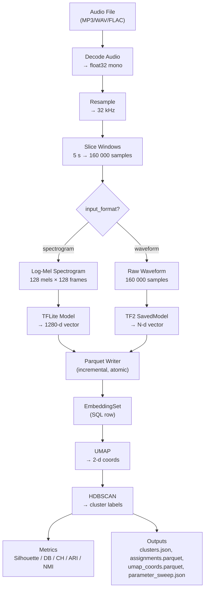

# Humpback Acoustic Embedding & Clustering Platform

## 1. Purpose

This system processes humpback whale audio recordings into reusable embedding vectors
using a Perch-compatible TFLite model, then performs clustering with optional
behavioral/ecological metadata.

The system must:
- Support asynchronous, resumable workflows
- Persist workflow state in SQL
- Prevent reprocessing of already-encoded audio for the same configuration
- Allow separate queuing of processing and clustering jobs
- Provide a web UI for job management and inspection

This document defines the high-level architecture, system behavior, and engineering rules
for implementing and testing the system.

---

## 2. High-Level Architecture

Components:
1. Web UI
2. API Server
3. Workflow Queue (SQL-backed)
4. Worker Processes (processing + clustering)
5. SQL Database
6. Object/File Storage (audio + embeddings + cluster outputs)
7. Clustering Engine

All components run locally for MVP but should be designed so workers can scale horizontally.

---

## 3. Core Development Rules

### 3.1 Package Management
*   **ONLY** use `uv` for all Python package operations. **NEVER** use `pip`, `pip-tools`, `poetry`, or `conda`.
*   Dependencies are managed via `pyproject.toml` and `uv.lock` files. The lock file should be committed to version control for reproducible builds.

### 3.2 Environment Commands
Use these commands for managing dependencies:
*   Install/synchronize all dependencies: `uv sync`
*   Add a new package (e.g., `requests`): `uv add requests`
*   Remove a package: `uv remove <package>`
*   Compile a new lock file: `uv pip compile pyproject.toml -o uv.lock`
*   Upgrade a specific package: `uv lock --upgrade-package <package>`

### 3.3 Running Python Code and Tools
*   Run a Python script: `uv run <script-name>.py`
*   Run Python tools/tests (e.g., `pytest`): `uv run pytest tests/`
*   Run pre-commit hooks: `uv run pre-commit install`

### 3.4 Best Practices
*   Prefer `uv run` over manually activating a virtual environment and running commands directly.
*   When troubleshooting, use `uv cache clean` as a last resort.

### 3.5 Documentation
*   When a change adds, removes, or modifies API endpoints, data models, configuration options, architecture, or workflows, update **both** `CLAUDE.md` and `README.md` to reflect the change.
*   `CLAUDE.md` is the authoritative spec — keep the data model, workflows, and design rules in sync with the code.
*   `README.md` is user-facing — keep the API endpoints table, configuration table, feature list, and architecture overview current.

## 3.6 Frontend Stack & Development

The web UI is a React SPA in the `frontend/` directory, built with:

| Layer | Technology |
|-------|-----------|
| Build | Vite + TypeScript |
| UI Framework | React 18 |
| Styling | Tailwind CSS |
| Component Library | shadcn/ui (Radix primitives, copy-paste model in `frontend/src/components/ui/`) |
| Server State | TanStack Query (polling, caching, mutations) |
| Charts | react-plotly.js (wraps Plotly.js basic dist) |
| Icons | lucide-react |
| API Client | Hand-rolled typed fetch wrapper (`frontend/src/api/client.ts`) |

**No React Router** — the UI uses tab-based navigation managed via React state, not URL routing.

#### Frontend Package Management
*   Use `npm` for all frontend package operations. Run commands from the `frontend/` directory.
*   `npm install` — install dependencies
*   `npm run dev` — start Vite dev server on `:5173` (proxies API calls to `:8000`)
*   `npm run build` — production build to `src/humpback/static/dist/`
*   `npx tsc --noEmit` — type-check without emitting

#### Frontend File Structure
```
frontend/
├── package.json, vite.config.ts, tsconfig.json, tailwind.config.ts
├── components.json              (shadcn/ui config)
├── index.html
└── src/
    ├── main.tsx                 (QueryClientProvider + App mount)
    ├── App.tsx                  (tab state + tab content switching)
    ├── index.css                (Tailwind directives + shadcn CSS vars)
    ├── lib/utils.ts             (cn() helper)
    ├── api/
    │   ├── client.ts            (typed fetch wrapper, all endpoints)
    │   └── types.ts             (TS interfaces mirroring Pydantic schemas)
    ├── hooks/queries/           (TanStack Query hooks per domain)
    ├── components/
    │   ├── ui/                  (shadcn primitives)
    │   ├── layout/              (AppShell, Header, TabNav)
    │   ├── audio/               (AudioTab, AudioUpload, AudioList, AudioDetail, AudioPlayerBar, SpectrogramPlot, SimilarityMatrix)
    │   ├── processing/          (ProcessingTab, QueueJobForm, ProcessingJobsList, EmbeddingSetsList)
    │   ├── clustering/          (ClusteringTab, EmbeddingSetSelector, ClusteringParamsForm, ClusteringJobCard, ClusterTable, UmapPlot, EvaluationPanel, ExportReport)
    │   ├── admin/               (AdminTab, ModelRegistry, ModelScanner, DatabaseAdmin)
    │   └── shared/              (FolderTree, StatusBadge, MessageToast)
    └── utils/                   (format.ts, audio.ts)
```

#### Dev Workflow
```bash
# Terminal 1: Backend
uv run humpback-api          # API on :8000
uv run humpback-worker       # Worker process

# Terminal 2: Frontend dev server
cd frontend && npm run dev   # Vite on :5173, proxies to :8000
```

#### Production Build & Serving
```bash
cd frontend && npm run build  # outputs to src/humpback/static/dist/
uv run humpback-api           # serves SPA at / and API on :8000
```

The FastAPI backend detects `static/dist/index.html` at startup. When present, it serves the built SPA at `/` and mounts `/assets` for JS/CSS bundles. When absent, it falls back to the legacy `static/index.html`.

---

## 4. Core Design Principles

### 4.1 Idempotent Encoding (No Reprocessing)
Each audio file is encoded once per (model_version, window_size, target_sample_rate, feature_config).

A ProcessingJob MUST:
- compute a stable "encoding_signature"
- check for an existing completed embedding set with that signature
- skip work if the embedding set exists

### 4.2 Resumable Workflow
All steps are recorded in SQL. Workers must be restart-safe:
- jobs can resume after crash/restart
- partial artifacts should be either:
  - safely overwritten, or
  - written to temp and atomically promoted on completion

### 4.3 Asynchronous, Observable Jobs
Jobs are queued and executed in the background by workers.
UI can monitor via polling or a push channel.

---

## 5. Data Model (Conceptual)

### ModelConfig (model registry) — DB table: model_configs
- id
- name (unique — used as model_version in jobs)
- display_name
- path (relative to project root)
- vector_dim
- description (optional)
- is_default (bool)
- model_type (string: "tflite" | "tf2_saved_model", default "tflite")
- input_format (string: "spectrogram" | "waveform", default "spectrogram")
- created_at, updated_at

Note: `TFLiteModelConfig` is kept as a backward-compatible alias for `ModelConfig`.

### AudioFile
- id
- filename
- checksum_sha256
- duration_seconds
- sample_rate_original
- created_at

### AudioMetadata (optional, editable)
- audio_file_id (FK)
- tag_data (JSON)
- visual_observations (JSON)
- group_composition (JSON)
- prey_density_proxy (JSON)

### ProcessingJob
- id
- audio_file_id (FK)
- status: queued | running | complete | failed | canceled
- encoding_signature (unique per audio+config)
- model_version
- window_size_seconds
- target_sample_rate
- feature_config (JSON)
- created_at
- updated_at
- error_message (nullable)

### EmbeddingSet (one per audio+signature)
- id
- audio_file_id (FK)
- encoding_signature (unique)
- model_version
- window_size_seconds
- target_sample_rate
- vector_dim
- parquet_path
- created_at

### ClusteringJob
- id
- status
- embedding_set_ids (JSON array or join table)
- parameters (JSON)
- created_at
- updated_at
- error_message
- metrics_json (JSON, nullable — internal/category metrics computed after clustering)

### Cluster
- id
- clustering_job_id
- cluster_label
- size
- metadata_summary (JSON)

### ClusterAssignment
- cluster_id
- embedding_row_id (row index in parquet OR FK to Embedding row table)

Note: do NOT store every embedding vector row in SQL in MVP; store embeddings in Parquet and
only store indexing/assignment references.

---

## 6. Processing Workflow

Input:
- audio file (MP3, WAV, or FLAC)
- optional metadata

Pipeline:
1. Resolve model: if model_version is None, use default from ModelConfig registry
2. Decode audio (MP3/WAV/FLAC)
3. Resample to target sample rate (default: 32000 Hz)
4. Slice into N-second windows (default: 5)
5. Branch on model's `input_format`:
   - `"spectrogram"`: Extract log-mel spectrogram (128 mel bins × 128 time frames) → model.embed()
   - `"waveform"`: Feed raw audio windows directly → model.embed() (TF2 SavedModel path)
6. Model inference (batched, model resolved from registry by model_version):
   - `model_type="tflite"` → TFLiteModel (spectrogram input)
   - `model_type="tf2_saved_model"` → TF2SavedModel (waveform input)
7. Produce embedding vectors (dims from model config)
8. Save embeddings to Parquet (incremental)
9. Persist EmbeddingSet row in SQL
10. Mark ProcessingJob complete

Rules:
- embeddings must be written incrementally (avoid holding all vectors in RAM)
- write parquet to temp path, then atomically rename/move on completion
- job must be restart-safe: if a temp exists, worker may resume or restart cleanly
- if EmbeddingSet exists for encoding_signature and is complete → skip
- worker caches loaded models in memory to avoid reloading across jobs

### 6.1 Processing Pipeline Diagram



### 6.2 Signal Processing Parameters

| Parameter | Default | Description |
|-----------|---------|-------------|
| `target_sample_rate` | 32 000 Hz | Resample target for all audio |
| `window_size_seconds` | 5.0 s | Window duration (= 160 000 samples at 32 kHz) |
| `n_mels` | 128 | Mel frequency bins |
| `n_fft` | 2048 | FFT window size |
| `hop_length` | 1252 | STFT hop (chosen so 160 000 samples → 128 frames) |
| `target_frames` | 128 | Time frames per spectrogram (pad/truncate) |
| Spectrogram shape | 128 × 128 | (n_mels × target_frames) |
| `vector_dim` | 1280 | Embedding dimensions (Perch default) |
| `batch_size` | 100 | Parquet writer flush interval |
| UMAP `n_neighbors` | 15 | UMAP neighbor count |
| UMAP `min_dist` | 0.1 | UMAP minimum distance |
| `umap_cluster_n_components` | 5 | UMAP dimensions for HDBSCAN input (visualization always 2D) |
| `cluster_selection_method` | leaf | HDBSCAN selection: 'leaf' (fine-grained) or 'eom' (coarser) |
| HDBSCAN `min_cluster_size` | 5 | Minimum points per cluster |
| `clustering_algorithm` | hdbscan | `"hdbscan"`, `"kmeans"`, or `"agglomerative"` |
| `n_clusters` | 15 | For kmeans/agglomerative |
| `linkage` | ward | For agglomerative: `"ward"`, `"complete"`, `"average"`, `"single"` |
| `reduction_method` | umap | `"umap"`, `"pca"`, or `"none"` |
| `distance_metric` | euclidean | `"euclidean"` or `"cosine"` (passed to UMAP + HDBSCAN) |
| `normalization` | per_window_max | Spectrogram normalization: `"per_window_max"`, `"global_ref"`, `"standardize"` (in feature_config) |
| Parameter sweep range | 2–50 | Sweeps HDBSCAN (min_cluster_size × selection_method) + K-Means (k=2..30) |

---

## 7. Clustering Workflow

Input:
- selected embedding sets (must share the same vector_dim)
- optional metadata filters (subset)

Pipeline:
1. Validate all embedding sets share the same vector_dim (reject with error if mismatched)
2. Load embeddings from Parquet
3. Optional dimensionality reduction (UMAP, PCA, or none — controlled by `reduction_method`)
4. Clustering (HDBSCAN, K-Means, or Agglomerative — controlled by `clustering_algorithm`)
5. Persist clusters and assignments
6. Compute per-cluster metadata summaries
7. Compute evaluation metrics (Silhouette, Davies-Bouldin, Calinski-Harabasz)
8. Compute detailed supervised metrics from folder-path-derived category labels:
   ARI, NMI, homogeneity, completeness, v_measure, per-category purity, confusion matrix
9. Run parameter sweep (HDBSCAN: min_cluster_size × selection_method; K-Means: k=2..30)
   with ARI/NMI when category labels available; save to parameter_sweep.json
10. Persist metrics as metrics_json on ClusteringJob
11. Mark ClusteringJob complete

---

## 8. Workflow Queue

Use SQL-backed queue semantics:
- Workers select queued jobs with row-level locking / "claim" update
- Status transitions:
  - queued → running → complete
  - queued → running → failed
  - queued → canceled

Concurrency:
- prevent two running ProcessingJobs for same encoding_signature
- allow multiple clustering jobs in parallel (configurable)

---

## 9. Storage Layout

/audio/
  raw/{audio_file_id}/original.(wav|mp3|flac)
/embeddings/
  {model_version}/{audio_file_id}/{encoding_signature}.parquet
  {model_version}/{audio_file_id}/{encoding_signature}.tmp.parquet
/clusters/
  {clustering_job_id}/clusters.json
  {clustering_job_id}/assignments.parquet
  {clustering_job_id}/umap_coords.parquet
  {clustering_job_id}/parameter_sweep.json

---

## 10. Web UI Requirements

Processing:
- Upload audio
- Attach/edit metadata
- Queue processing job
- Monitor status and progress
- Audio detail: show file info, processing history, embedding set(s)

Clustering:
- Select embedding sets
- Configure clustering parameters
- Queue clustering job
- Monitor status
- Cluster detail: members and metadata distributions

Editing:
- Manage/edit AudioMetadata associated with audio file

---

## 11. Testing Requirements (MANDATORY)

Testing is not optional. Every meaningful change must include:
- unit tests for new logic
- integration tests for API endpoints
- at least one end-to-end smoke test path that exercises the real workflows

### 11.1 Unit Tests
Add unit tests for:
- encoding_signature computation (idempotency)
- audio window slicing logic
- feature extraction shape correctness
- TFLite runner batching (mock interpreter acceptable)
- Parquet writer behavior (temp + atomic promote)
- clustering pipeline (small synthetic embeddings)

Guidelines:
- prefer deterministic tests
- isolate file I/O behind temp directories
- mock external dependencies when appropriate (e.g., TFLite interpreter)

### 11.2 Running Tests Locally
The repo must include:
- `pytest` configuration
- a single command to run unit+integration tests
- a command to run tests continuously on file changes

Required commands:
- `pytest` (all tests)
- `pytest -q` (quiet)
- `pytest -k <pattern>` (focused)
- "watch mode" (choose one):
  - `pytest-watch` (`ptw`) OR
  - `watchexec -r pytest` OR
  - `entr -r pytest`

Document the chosen tool in README and add it to dev dependencies.

### 11.3 End-to-End Smoke Test (E2E)
Add a minimal E2E test that:
1. Starts API + worker (in-process for tests or via subprocess)
2. Uploads a small fixture audio file
3. Queues a ProcessingJob
4. Polls until job completes
5. Verifies EmbeddingSet exists and parquet file is readable
6. Queues a ClusteringJob on that embedding set
7. Polls until complete
8. Verifies clusters and assignments exist and are consistent

Constraints:
- E2E must run in under a few minutes locally
- Use a tiny audio fixture (e.g., 10–20 seconds)
- Use a tiny embedding model stub if needed (see below)

### 11.4 Model Stub Strategy (So Tests Are Fast)
For unit/integration/E2E tests:
- Provide a "FakeTFLiteModel" implementation that returns deterministic embeddings
  (e.g., sine/cosine transforms of window index)
- Gate real Perch model execution behind an environment flag
  - default tests use FakeTFLiteModel
  - optional manual run uses real model if available

---

## 12. Definition of Done (Engineering)
A PR/change is "done" only if:
- unit tests added/updated for changed behavior
- test suite passes locally
- E2E smoke test passes locally
- idempotency rules preserved (no duplicate embedding sets)

---

## 13. Non-Goals (MVP)
- Model fine-tuning
- Real-time streaming inference
- Multi-tenant support
- Distributed GPU execution
