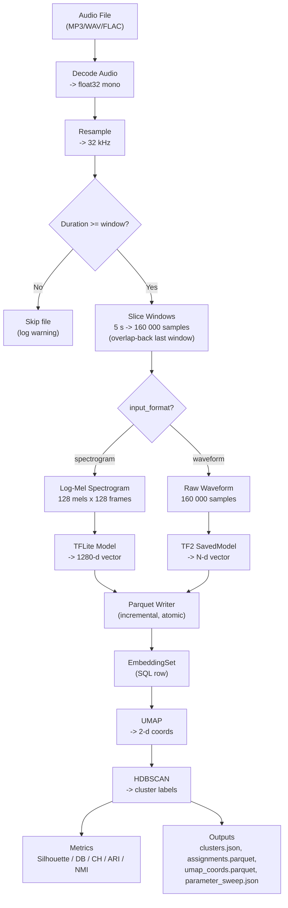

# Humpback Acoustic Embedding & Clustering Platform

## 1. Purpose

This system processes humpback whale audio recordings into reusable embedding vectors
using a Perch-compatible TFLite model, then performs clustering with optional
behavioral/ecological metadata.

The system must:
- Support asynchronous, resumable workflows
- Persist workflow state in SQL
- Prevent reprocessing of already-encoded audio for the same configuration
- Allow separate queuing of processing and clustering jobs
- Provide a web UI for job management and inspection

This document defines behavioral rules, engineering constraints, project reference
material, and workflow integration. For architecture decisions, see `DECISIONS.md`.
For Codex-specific workflow, see `AGENTS.md`.

---

## 2. High-Level Architecture

Components:
1. Web UI
2. API Server
3. Workflow Queue (SQL-backed)
4. Worker Processes (processing + clustering)
5. SQL Database
6. Object/File Storage (audio + embeddings + cluster outputs)
7. Clustering Engine

All components run locally for MVP but should be designed so workers can scale horizontally.

---

## 3. Core Development Rules

### 3.1 Package Management
*   **ONLY** use `uv` for all Python package operations. **NEVER** use `pip`, `pip-tools`, `poetry`, or `conda`.
*   Dependencies are managed via `pyproject.toml` and `uv.lock` files. The lock file should be committed to version control for reproducible builds.
*   TensorFlow is selected via mutually-exclusive extras: `tf-macos`, `tf-linux-cpu`, or `tf-linux-gpu`.
*   Do **NOT** use `uv sync --all-extras` in this project because the TensorFlow extras intentionally conflict.

### 3.2 Environment Commands
Use these commands for managing dependencies:
*   Install/synchronize Apple Silicon macOS dependencies (including dev tools): `uv sync --group dev --extra tf-macos`
*   Install/synchronize Linux CPU dependencies (including dev tools): `uv sync --group dev --extra tf-linux-cpu`
*   Install/synchronize Linux GPU/CUDA dependencies (including dev tools): `uv sync --group dev --extra tf-linux-gpu`
*   Install production Linux GPU/CUDA dependencies (no dev tools): `uv sync --extra tf-linux-gpu`
*   Add a new package (e.g., `requests`): `uv add requests`
*   Remove a package: `uv remove <package>`
*   Refresh the lock file after dependency changes: `uv lock`
*   Upgrade a specific package: `uv lock --upgrade-package <package>`

### 3.3 Running Python Code and Tools
*   Run a Python script: `uv run <script-name>.py`
*   Run Python tools/tests (e.g., `pytest`): `uv run pytest tests/`
*   Run the Python type checker: `uv run pyright`
*   Install pre-commit hooks once per clone: `uv run pre-commit install`
*   Run all pre-commit hooks manually: `uv run pre-commit run --all-files`

### 3.4 Best Practices
*   Prefer `uv run` over manually activating a virtual environment and running commands directly.
*   Python edits must pass pre-commit Ruff and Pyright hooks before commit.
*   Pyright enforcement covers `src/humpback`, `scripts/`, and `tests/`; expand deliberately after cleaning any new areas.
*   When troubleshooting, use `uv cache clean` as a last resort.

### 3.5 Database Migrations
*   When a change adds, removes, or renames columns on any SQL table, **always** create an Alembic migration in `alembic/versions/` and run it with `uv run alembic upgrade head` before verifying the change works.
*   Migration files follow the naming convention `NNN_short_description.py` (e.g., `007_negative_embedding_set_ids.py`), incrementing from the latest revision.
*   Use `op.batch_alter_table()` for SQLite compatibility.

### 3.6 Documentation
*   When a change adds, removes, or modifies API endpoints, data models, configuration options, architecture, or workflows, update the relevant files:
    *   `CLAUDE.md` — rules, reference material, project state (this file)
    *   `DECISIONS.md` — append new ADR for significant architecture changes
    *   `README.md` — user-facing API endpoints, configuration, feature list
    *   `docs/specs/` — design specs (written during brainstorming phase)
    *   `docs/plans/` — implementation plans (written during planning phase)

## 3.7 Frontend Stack & Development

The web UI is a React SPA in the `frontend/` directory, built with:

| Layer | Technology |
|-------|-----------|
| Build | Vite + TypeScript |
| UI Framework | React 18 |
| Styling | Tailwind CSS |
| Component Library | shadcn/ui (Radix primitives, copy-paste model in `frontend/src/components/ui/`) |
| Server State | TanStack Query (polling, caching, mutations) |
| Charts | react-plotly.js (wraps Plotly.js basic dist) |
| Icons | lucide-react |
| API Client | Hand-rolled typed fetch wrapper (`frontend/src/api/client.ts`) |

**Navigation**: Side nav + top nav layout with react-router-dom. Classifier has sub-routes (`/app/classifier/training`, `/app/classifier/hydrophone`, `/app/classifier/labeling`); the timeline viewer is at `/app/classifier/timeline/:jobId`; other sections are single-route pages.

#### Frontend Package Management
*   Use `npm` for all frontend package operations. Run commands from the `frontend/` directory.
*   `npm install` — install dependencies
*   `npm run dev` — start Vite dev server on `:5173` (proxies API calls to `:8000`)
*   `npm run build` — production build to `src/humpback/static/dist/`
*   `npx tsc --noEmit` — type-check without emitting

#### Frontend File Structure
```
frontend/
├── package.json, vite.config.ts, tsconfig.json, tailwind.config.ts
├── playwright.config.ts         (Playwright test config)
├── components.json              (shadcn/ui config)
├── index.html
├── e2e/                         (Playwright test specs)
└── src/
    ├── main.tsx                 (QueryClientProvider + App mount)
    ├── App.tsx                  (routes + AppShell wrapper)
    ├── index.css                (Tailwind directives + shadcn CSS vars)
    ├── lib/utils.ts             (cn() helper)
    ├── api/
    │   ├── client.ts            (typed fetch wrapper, all endpoints)
    │   └── types.ts             (TS interfaces mirroring Pydantic schemas)
    ├── hooks/queries/           (TanStack Query hooks per domain)
    ├── components/
    │   ├── ui/                  (shadcn primitives)
    │   ├── layout/              (AppShell, TopNav, SideNav, Breadcrumbs)
    │   ├── audio/               (AudioTab, AudioUpload, AudioList, AudioDetail, AudioPlayerBar, SpectrogramPlot, SimilarityMatrix)
    │   ├── processing/          (ProcessingTab, QueueJobForm, ProcessingJobsList, EmbeddingSetsList)
    │   ├── clustering/          (ClusteringTab, EmbeddingSetSelector, ClusteringParamsForm, ClusteringJobCard, ClusterTable, UmapPlot, EvaluationPanel, ExportReport)
    │   ├── classifier/          (TrainingTab, HydrophoneTab, LabelingTab, DetectionTab, BulkDeleteDialog)
    │   ├── timeline/            (TimelineViewer, Minimap, SpectrogramViewport, TileCanvas, LabelEditor, LabelToolbar, etc.)
    │   ├── search/              (SearchTab — standalone + detection-sourced similarity search)
    │   ├── label-processing/    (LabelProcessingTab, LabelProcessingJobCard, LabelProcessingPreview)
    │   ├── admin/               (AdminTab, ModelRegistry, ModelScanner, DatabaseAdmin)
    │   └── shared/              (FolderTree, FolderBrowser, StatusBadge, MessageToast, DateRangePickerUtc, EmbeddingSetPanel)
    └── utils/                   (format.ts, audio.ts)
```

#### Dev Workflow
```bash
# Terminal 1: Backend
uv run humpback-api          # API on :8000
uv run humpback-worker       # Worker process

# Terminal 2: Frontend dev server
cd frontend && npm run dev   # Vite on :5173, proxies to :8000
```

#### Production Build & Serving
```bash
cd frontend && npm run build  # outputs to src/humpback/static/dist/
uv run humpback-api           # serves SPA at / and API on :8000
```

The FastAPI backend detects `static/dist/index.html` at startup. When present, it serves the built SPA at `/` and mounts `/assets` for JS/CSS bundles. When absent, it falls back to the legacy `static/index.html`.
Deployment/runtime configuration should come from a repo-root `.env` plus
`HUMPBACK_` env vars. The API and worker entrypoints explicitly load the
repo-root `.env`; direct `Settings()` construction should stay hermetic.
Production host allowlisting belongs in FastAPI via `HUMPBACK_ALLOWED_HOSTS`;
do not use Vite `allowedHosts` for deployed host validation.

### 3.8 Timezone and Timestamp Standard (UTC-Only)
All operational timestamps in this project must use UTC end-to-end.

*   Backend must compute, compare, persist, and serialize timestamps in UTC.
*   API timestamp fields should be UTC epoch seconds or ISO-like values with `Z` semantics.
*   Frontend must parse and submit timestamp inputs as UTC for project workflows unless an endpoint explicitly requires local time.
*   Frontend displays for operational time ranges must be labeled as UTC; avoid locale-time rendering for these values.
*   Time-derived filenames/identifiers must use compact UTC format (`%Y%m%dT%H%M%SZ`), including detection/extraction naming paths.
*   Tests touching timestamp behavior must assert UTC semantics explicitly.

---

## 4. Core Design Principles

### 4.1 Idempotent Encoding (No Reprocessing)
Each audio file is encoded once per (model_version, window_size, target_sample_rate, feature_config).

A ProcessingJob MUST:
- compute a stable "encoding_signature"
- check for an existing completed embedding set with that signature
- skip work if the embedding set exists

### 4.2 Resumable Workflow
All steps are recorded in SQL. Workers must be restart-safe:
- jobs can resume after crash/restart
- partial artifacts should be either:
  - safely overwritten, or
  - written to temp and atomically promoted on completion

### 4.3 Asynchronous, Observable Jobs
Jobs are queued and executed in the background by workers.
UI can monitor via polling or a push channel.

### 4.4 Hydrophone Extraction Path Convention
Hydrophone labeled-sample extraction groups by species/category first, then hydrophone:
- positives: `{positive_output_path}/{humpback|orca}/{hydrophone_id}/YYYY/MM/DD/*.flac`
- negatives: `{negative_output_path}/{ship|background}/{hydrophone_id}/YYYY/MM/DD/*.flac`
- hydrophone extraction should over-fetch a small real-audio guard band and
  hard-trim clips to the expected sample count when archive audio exists;
  never zero-pad short archive clips just to satisfy a window length
- every extracted labeled clip (local and hydrophone) must also write a sibling
  `.png` spectrogram sidecar using the same marker-free base rendering as the UI
  spectrogram popup for that extracted clip window

### 4.5 Hydrophone Timeline Assembly
Hydrophone detection, playback, and extraction must use the same bounded stream timeline:
- segment ordering must be numeric by segment suffix (never plain lexicographic)
- playlist (`live.m3u8`) duration metadata should be used when available
- sparse local cache segment sets must preserve playlist timeline offsets
  (do not assume the first cached segment starts at folder timestamp)
- folder discovery should start at the requested range and expand backward
  by configurable hour increments (default 4h), up to configurable max
  lookback (default 168h), stopping once overlap at the requested start
  boundary is found
- processing/playback/extraction must stay within `[start_timestamp, end_timestamp]`
- legacy playback compatibility for older jobs may fall back to `job.start_timestamp`
- Orcasound HLS playback/extraction is local-cache-authoritative: resolve from local HLS cache only, with no S3 listing/fetch fallback
- Non-HLS archive providers may use their own direct-fetch playback/extraction path when explicitly configured (for example NOAA GCS `.aif`)
- hydrophone extraction should build/reuse timeline metadata once per extraction run (avoid rebuilding per labeled row)
- hydrophone detection jobs with no overlapping stream audio in the requested range
  must fail with an explicit error message (never silently complete with zero windows)

### 4.6 Hydrophone Detection TSV Metadata
Hydrophone detection TSV output should carry canonical event metadata:
- canonical `start_sec`/`end_sec` represent snapped clip bounds (window-size multiples)
- include `raw_start_sec`/`raw_end_sec` and `merged_event_count` for audit/debug provenance
- include `detection_filename` for hydrophone rows (`{start_utc}_{end_utc}.flac`, snapped canonical bounds)
- keep `extract_filename` as a legacy alias to the same canonical filename for compatibility; explicit legacy `.wav` values must remain readable
- include `hydrophone_name` for hydrophone rows (short form, e.g., `rpi_north_sjc`)
- persist positive-selection provenance in `positive_selection_*` columns plus
  `positive_extract_filename`; positive extraction seeds from the best 5-second
  scored window and may widen in 5-second chunks when adjacent chunks remain
  above the configured extension threshold
- local detection TSV rows follow the same canonical snapped bounds + raw audit metadata

### 4.7 Hydrophone Job Lifecycle
Hydrophone detection jobs support the following status transitions:
- `queued` → `running` (worker claims job)
- `running` → `paused` (user pauses via API/UI)
- `paused` → `running` (user resumes via API/UI)
- `running` or `paused` → `canceled` (user cancels; partial results preserved)
- `running` → `complete` (normal completion)
- `running` → `failed` (error during processing)
- TF2 SavedModel hydrophone detection must run in a short-lived subprocess so
  TensorFlow/Metal memory is reclaimed between jobs; the parent worker remains
  responsible for progress, diagnostics, alerts, and pause/resume/cancel state
- Paused jobs remain in the Active Job panel; the worker thread blocks until resumed or canceled
- Paused jobs with partial TSV output remain readable through
  `/classifier/detection-jobs/{id}/content`
- Canceled jobs are fully functional in the Previous Jobs panel (expandable, downloadable, label-editable, extractable)

---

## 5. Testing Requirements (MANDATORY)

Testing is not optional. Every meaningful change must include:
- unit tests for new logic
- integration tests for API endpoints
- at least one end-to-end smoke test path that exercises the real workflows

### 5.1 Unit Tests
Add unit tests for:
- encoding_signature computation (idempotency)
- audio window slicing logic
- feature extraction shape correctness
- TFLite runner batching (mock interpreter acceptable)
- Parquet writer behavior (temp + atomic promote)
- clustering pipeline (small synthetic embeddings)

Guidelines:
- prefer deterministic tests
- isolate file I/O behind temp directories
- mock external dependencies when appropriate (e.g., TFLite interpreter)

### 5.2 Running Tests Locally
The repo must include:
- `pytest` configuration
- a single command to run unit+integration tests
- a command to run tests continuously on file changes

Required commands:
- `pytest` (all tests)
- `pytest -q` (quiet)
- `pytest -k <pattern>` (focused)
- "watch mode" (choose one):
  - `pytest-watch` (`ptw`) OR
  - `watchexec -r pytest` OR
  - `entr -r pytest`

Document the chosen tool in README and add it to dev dependencies.

### 5.3 End-to-End Smoke Test (E2E)
Add a minimal E2E test that:
1. Starts API + worker (in-process for tests or via subprocess)
2. Uploads a small fixture audio file
3. Queues a ProcessingJob
4. Polls until job completes
5. Verifies EmbeddingSet exists and parquet file is readable
6. Queues a ClusteringJob on that embedding set
7. Polls until complete
8. Verifies clusters and assignments exist and are consistent

Constraints:
- E2E must run in under a few minutes locally
- Use a tiny audio fixture (e.g., 10–20 seconds)
- Use a tiny embedding model stub if needed (see below)

### 5.4 Frontend Tests (Playwright)
When changing UI components, add or update Playwright tests in `frontend/e2e/`.

**When to add tests:**
- Any new interactive feature (buttons, forms, expandable rows, audio playback)
- Changes to data flow between frontend and backend (API calls, query hooks)
- Bug fixes for UI behavior (regression tests)

**Test patterns:**
- **API-level tests** — use `request` fixture to hit backend endpoints directly and validate response content (e.g., WAV duration, JSON shape). These are fast and don't need a browser page.
- **UI interaction tests** — use `page` fixture to navigate, click, and assert DOM state. Verify that user actions produce correct side effects (e.g., audio element src, table expansion, form submission).
- **Hydrophone regressions** — include timestamp-mapping playback checks and Extract-button activation checks when fixing Hydrophone tab playback/label workflows.
- Skip gracefully when preconditions aren't met (e.g., no completed jobs) using `test.skip()`.

**Running:**
```bash
cd frontend
npx playwright test                    # all tests
npx playwright test e2e/some.spec.ts   # specific file
npx playwright test -g "test name"     # by name pattern
npx playwright test --headed           # see the browser
```

**Requirements:**
- Tests run against `localhost:5173` (frontend dev server) proxying to `localhost:8000` (backend)
- Backend must be running with real or fixture data
- Config is in `frontend/playwright.config.ts`; tests go in `frontend/e2e/*.spec.ts`
- Install browsers once: `cd frontend && npx playwright install chromium`

### 5.5 Model Stub Strategy (So Tests Are Fast)
For unit/integration/E2E tests:
- Provide a "FakeTFLiteModel" implementation that returns deterministic embeddings
  (e.g., sine/cosine transforms of window index)
- Gate real Perch model execution behind an environment flag
  - default tests use FakeTFLiteModel
  - optional manual run uses real model if available

---

## 6. Definition of Done (Engineering)
A PR/change is "done" only if:
- unit tests added/updated for changed behavior
- test suite passes locally
- E2E smoke test passes locally
- Playwright tests added/updated for UI changes (`cd frontend && npx playwright test`)
- idempotency rules preserved (no duplicate embedding sets)

---

## 7. Non-Goals (MVP)
- Model fine-tuning
- Real-time streaming inference
- Multi-tenant support
- Distributed GPU execution

---

## 8. Project Reference

### 8.1 Technology Stack

| Layer | Technology |
|-------|-----------|
| Language | Python 3.11-3.12 |
| Package Manager | uv (pyproject.toml + uv.lock, explicit TensorFlow extras by platform) |
| Web Framework | FastAPI |
| Database | SQLite (via SQLAlchemy) |
| Migrations | Alembic |
| Embedding Format | Apache Parquet |
| ML Models | TFLite (Perch), TF2 SavedModel |
| Clustering | HDBSCAN, K-Means, Agglomerative |
| Dim Reduction | UMAP, PCA |
| Metric Learning | PyTorch (triplet loss MLP) |
| Classifier | scikit-learn LogisticRegression |
| Frontend | React 18 + Vite + TypeScript + Tailwind + shadcn/ui |
| Charts | react-plotly.js |
| Server State | TanStack Query |
| Testing | pytest + pre-commit/Ruff (backend), Playwright (frontend) |

### 8.2 Repository Layout

```
humpback-acoustic-embed/
├── CLAUDE.md              (rules, reference, project state — auto-loaded)
├── AGENTS.md              (Codex entry point)
├── DECISIONS.md           (architecture decision log)
├── pyproject.toml         (Python dependencies)
├── uv.lock                (lockfile)
├── alembic.ini            (migration config)
├── alembic/versions/      (migration scripts, 001–025)
├── src/humpback/
│   ├── api/               (FastAPI routes)
│   ├── classifier/        (training, detection, embedding)
│   ├── clustering/        (HDBSCAN, K-Means, metrics, refinement)
│   ├── config.py          (settings)
│   ├── data/              (packaged metadata assets such as NOAA archive sources)
│   ├── database.py        (SQLAlchemy models + session)
│   ├── models/            (TFLite + TF2 model runners)
│   ├── processing/        (audio decode, windowing, features, parquet)
│   ├── schemas/           (Pydantic request/response models)
│   ├── services/          (business logic layer)
│   ├── static/            (built frontend SPA)
│   ├── storage.py         (file path helpers)
│   └── workers/           (background job processing)
├── frontend/              (React SPA — see §3.7)
├── tests/                 (pytest suite)
├── models/                (ML model files)
├── scripts/               (utility scripts)
├── docs/
│   ├── specs/             (design specs from brainstorming)
│   └── plans/             (implementation plans + backlog)
└── data/                  (runtime data)
```

### 8.3 Data Model Summary

Condensed model reference. For full field lists, see `src/humpback/database.py`.

- **ModelConfig** (`model_configs`) — ML model registry entry (name, path, vector_dim, model_type, input_format, is_default). `TFLiteModelConfig` is a backward-compatible alias.
- **AudioFile** (`audio_files`) — uploaded/imported audio (filename, folder_path, source_folder, checksum_sha256, duration_seconds, sample_rate_original)
- **AudioMetadata** (`audio_metadata`) — optional editable metadata per audio file (tag_data, visual_observations, group_composition, prey_density_proxy — all JSON)
- **ProcessingJob** (`processing_jobs`) — encoding job (audio_file_id FK, encoding_signature, model_version, window_size_seconds, target_sample_rate, feature_config JSON, status, warning_message)
- **EmbeddingSet** (`embedding_sets`) — one per audio+encoding_signature (parquet_path, model_version, vector_dim). Embeddings stored in Parquet, not SQL.
- **SearchJob** (`search_jobs`) — ephemeral similarity search, deleted after results returned (detection_job_id, top_k, metric, embedding_set_ids, embedding_vector)
- **ClusteringJob** (`clustering_jobs`) — clustering run (embedding_set_ids JSON, parameters JSON, metrics_json, refined_from_job_id)
- **Cluster** (`clusters`) — one per cluster label per job (clustering_job_id FK, cluster_label, size, metadata_summary JSON)
- **ClusterAssignment** (`cluster_assignments`) — links cluster to embedding row index (cluster_id FK, embedding_row_id)
- **ClassifierModel** (`classifier_models`) — binary classifier artifact (name, model_path .joblib, model_version, vector_dim, training_summary JSON)
- **ClassifierTrainingJob** (`classifier_training_jobs`) — training run (positive/negative_embedding_set_ids JSON, classifier_model_id set on completion)
- **DetectionJob** (`detection_jobs`) — local or hydrophone detection scan (classifier_model_id FK, audio_folder, confidence/hop/threshold params, detection_mode, output_tsv_path, result_summary JSON, extract_* columns)
- **LabelProcessingJob** (`label_processing_jobs`) — score-based audio sample extraction (classifier_model_id, annotation_folder, audio_folder, output_root, parameters JSON, result_summary JSON)
- **VocalizationLabel** (`vocalization_labels`) — per-detection vocalization type label (detection_job_id, row_id, label, source)
- **LabelingAnnotation** (`labeling_annotations`) — sub-window annotation boundary (detection_job_id, row_id, start_sec, end_sec, label)
- **RetrainWorkflow** (`retrain_workflows`) — orchestrated reimport+reprocess+retrain (status, step, provenance)

### 8.4 Signal Processing Parameters

| Parameter | Default | Description |
|-----------|---------|-------------|
| `target_sample_rate` | 32 000 Hz | Resample target for all audio |
| `window_size_seconds` | 5.0 s | Window duration (= 160 000 samples at 32 kHz) |
| `n_mels` | 128 | Mel frequency bins |
| `n_fft` | 2048 | FFT window size |
| `hop_length` | 1252 | STFT hop (chosen so 160 000 samples -> 128 frames) |
| `target_frames` | 128 | Time frames per spectrogram (pad/truncate) |
| Spectrogram shape | 128 x 128 | (n_mels x target_frames) |
| `vector_dim` | 1280 | Embedding dimensions (Perch default) |
| `batch_size` | 100 | Parquet writer flush interval |
| UMAP `n_neighbors` | 15 | UMAP neighbor count |
| UMAP `min_dist` | 0.1 | UMAP minimum distance |
| `umap_cluster_n_components` | 5 | UMAP dimensions for HDBSCAN input (visualization always 2D) |
| `cluster_selection_method` | leaf | HDBSCAN selection: 'leaf' (fine-grained) or 'eom' (coarser) |
| HDBSCAN `min_cluster_size` | 5 | Minimum points per cluster |
| `clustering_algorithm` | hdbscan | `"hdbscan"`, `"kmeans"`, or `"agglomerative"` |
| `n_clusters` | 15 | For kmeans/agglomerative |
| `linkage` | ward | For agglomerative: `"ward"`, `"complete"`, `"average"`, `"single"` |
| `reduction_method` | umap | `"umap"`, `"pca"`, or `"none"` |
| `distance_metric` | euclidean | `"euclidean"` or `"cosine"` (passed to UMAP + HDBSCAN) |
| `normalization` | per_window_max | Spectrogram normalization: `"per_window_max"`, `"global_ref"`, `"standardize"` (in feature_config) |
| Parameter sweep range | 2-50 | Sweeps HDBSCAN (min_cluster_size x selection_method) + K-Means (k=2..30) |
| `tf_force_cpu` | `false` | Force CPU for TF2 SavedModel inference, skipping GPU (env: `HUMPBACK_TF_FORCE_CPU`) |
| `run_classifier` | `false` | Opt-in: run logistic regression classifier baseline on category labels |
| `stability_runs` | 0 | Opt-in: number of stability re-runs (>= 2 to enable); re-clusters with different random seeds |
| `enable_metric_learning` | `false` | Opt-in: train MLP projection head via triplet loss, re-cluster, compare metrics |
| `ml_output_dim` | 128 | Metric learning: projection output dimensionality |
| `ml_hidden_dim` | 512 | Metric learning: hidden layer dimensionality |
| `ml_n_epochs` | 50 | Metric learning: training epochs |
| `ml_lr` | 0.001 | Metric learning: Adam learning rate |
| `ml_margin` | 1.0 | Metric learning: triplet loss margin |
| `ml_batch_size` | 256 | Metric learning: triplets per epoch |
| `ml_mining_strategy` | semi-hard | Metric learning: `"random"`, `"hard"`, or `"semi-hard"` triplet mining |

#### Windowing Rules

Audio is sliced into fixed-length windows using an **overlap-back** strategy instead of zero-padding:

| Scenario | Behavior |
|----------|----------|
| Audio >= 1 window, last chunk is full | Normal: no overlap, no padding |
| Audio >= 1 window, last chunk is partial | **Overlap-back**: shift last window start backward so it ends at the audio boundary, overlapping with the previous window. Contains only real audio. |
| Audio < 1 window (shorter than `window_size_seconds`) | **Skipped entirely**: produces 0 windows, 0 embeddings. A warning is logged. |

**Why not zero-pad?** Zero-padded final windows create out-of-distribution spectrograms that cause false positives in classifiers. The overlap-back strategy ensures every window contains only real audio.

**Minimum audio duration** = `window_size_seconds` (default 5.0 s). Audio files shorter than this threshold are skipped by:
- `slice_windows()` / `slice_windows_with_metadata()` — yield nothing
- `count_windows()` — returns 0
- Processing worker — logs warning, writes empty embedding set
- Detection worker — logs warning, increments `n_skipped_short` in summary
- Trainer (`embed_audio_folder`) — logs warning, skips file

`WindowMetadata` carries `is_overlapped: bool` to flag overlap-back windows (replacing the former `is_padded` field).

#### Processing Pipeline Diagram


```mermaid
flowchart TD
    A["Audio File<br/>(MP3/WAV/FLAC)"] --> B["Decode Audio<br/>-> float32 mono"]
    B --> C["Resample<br/>-> 32 kHz"]
    C --> D{"Duration >= window?"}
    D -- No --> D2["Skip file<br/>(log warning)"]
    D -- Yes --> D3["Slice Windows<br/>5 s -> 160 000 samples<br/>(overlap-back last window)"]
    D3 --> E{input_format?}
    E -- spectrogram --> F["Log-Mel Spectrogram<br/>128 mels x 128 frames"]
    E -- waveform --> G["Raw Waveform<br/>160 000 samples"]
    F --> H["TFLite Model<br/>-> 1280-d vector"]
    G --> I["TF2 SavedModel<br/>-> N-d vector"]
    H --> J["Parquet Writer<br/>(incremental, atomic)"]
    I --> J
    J --> K["EmbeddingSet<br/>(SQL row)"]
    K --> L["UMAP<br/>-> 2-d coords"]
    L --> M["HDBSCAN<br/>-> cluster labels"]
    M --> N["Metrics<br/>Silhouette / DB / CH / ARI / NMI"]
    M --> O["Outputs<br/>clusters.json, assignments.parquet,<br/>umap_coords.parquet, parameter_sweep.json"]
```

### 8.5 Storage Layout

```
/audio/
  raw/{audio_file_id}/original.(wav|mp3|flac)    (uploaded files only; imported files are read from source_folder)
/embeddings/
  {model_version}/{audio_file_id}/{encoding_signature}.parquet
  {model_version}/{audio_file_id}/{encoding_signature}.tmp.parquet
/clusters/
  {clustering_job_id}/clusters.json
  {clustering_job_id}/assignments.parquet
  {clustering_job_id}/umap_coords.parquet
  {clustering_job_id}/parameter_sweep.json
  {clustering_job_id}/report.json                (fragmentation report)
  {clustering_job_id}/classifier_report.json     (opt-in classifier baseline)
  {clustering_job_id}/label_queue.json           (opt-in active learning queue)
  {clustering_job_id}/stability_summary.json     (opt-in stability evaluation)
  {clustering_job_id}/refinement_report.json     (opt-in metric learning refinement)
  {clustering_job_id}/refined_embeddings.parquet (opt-in refined embedding vectors for re-clustering)
/classifiers/
  {classifier_model_id}/model.joblib              (StandardScaler + LogisticRegression pipeline)
  {classifier_model_id}/training_summary.json
/detections/
  {detection_job_id}/detection_rows.parquet       (canonical editable row store)
  {detection_job_id}/detections.tsv               (generated on-the-fly for download; not persisted)
  {detection_job_id}/window_diagnostics.parquet   (local: single file; hydrophone: shard directory)
  {detection_job_id}/run_summary.json
```

/timeline_cache/
  {job_id}/{zoom_level}/tile_{NNNN}.png   (per-job LRU-evicted spectrogram tiles)
```

Timeline audio endpoint supports `format=mp3` for compressed playback (128kbps mono, up to 600s segments).

```
Hydrophone extraction output:
- Positive labels: `{positive_sample_path}/{humpback|orca}/{hydrophone_id}/YYYY/MM/DD/{start}_{end}.flac`
- Negative labels: `{negative_sample_path}/{ship|background}/{hydrophone_id}/YYYY/MM/DD/{start}_{end}.flac`
- Local extraction: same structure without `{hydrophone_id}/` level
- Every `.flac` also gets a same-basename `.png` spectrogram sidecar

### 8.6 Runtime Configuration

- `Settings` reads `HUMPBACK_`-prefixed environment variables.
- API and worker entrypoints load the repo-root `.env`; direct `Settings()` does not.
- `api_host` defaults to `0.0.0.0`, `api_port` to `8000`.
- `allowed_hosts` defaults to `*`. `HUMPBACK_ALLOWED_HOSTS` uses Starlette wildcard syntax.
- `positive_sample_path`, `negative_sample_path`, `s3_cache_path` derive from `storage_root` when unset.
- `timeline_cache_max_jobs` defaults to `15`. `HUMPBACK_TIMELINE_CACHE_JOBS` controls how many detection jobs keep fully cached timeline tiles on disk (~8-16 GB at default). LRU eviction removes the oldest job when exceeded.

### 8.7 Behavioral Constraints

Non-obvious constraints that are not immediately derivable from code:

- **Worker priority order**: search -> processing -> clustering -> classifier training -> detection -> extraction -> label processing -> retrain
- **Job claim semantics**: Workers claim queued jobs via atomic compare-and-set (`WHERE id=:candidate AND status='queued'`). SQLite has no true row-level locks; correctness relies on atomic status updates, not `SELECT ... FOR UPDATE`.
- **Job status transitions**: `queued -> running -> complete`, `queued -> running -> failed`, `queued -> canceled`
- **Processing concurrency**: prevent two running ProcessingJobs for same encoding_signature; allow multiple clustering jobs in parallel
- **Prefetch semantics**: `time_covered_sec` tracks summed processed audio duration rather than wall-clock range coverage
- **Parquet row-store**: detection jobs write directly to Parquet row store during detection; TSV is generated on-the-fly for download only; legacy jobs with only TSV are lazily upgraded on first access
- **Timeline label editing**: enforces single-label-per-row (mutual exclusivity of humpback/orca/ship/background); batch edits via `PATCH /classifier/detection-jobs/{id}/labels` with overlap validation

---

## 9. Current State

### 9.1 Implemented Capabilities

- Audio upload, folder import, metadata editing
- Processing pipeline: TFLite + TF2 SavedModel, overlap-back windowing, incremental Parquet
- Embedding similarity search (cosine/euclidean, cross-set, detection-sourced)
- Clustering: HDBSCAN/K-Means/Agglomerative, UMAP/PCA, parameter sweeps, metric learning
- Binary classifier training (LogisticRegression/MLP) + local/hydrophone detection
- Hydrophone streaming: Orcasound HLS + NOAA archives, pause/resume/cancel, subprocess isolation
- Label processing: score-based + sample-builder workflows
- Vocalization labeling: type classification, active learning, sub-window annotations
- Retrain workflow: reimport -> reprocess -> retrain
- Timeline viewer: zoomable spectrogram with background tile pre-caching (all zoom levels), interactive species labeling (add/move/delete/change-type with batch save at 1m and 5m zoom), warm/cool color-coded detection label bars with hover tooltips, audio-authoritative playhead sync, gapless double-buffered MP3 playback
- Web UI: routed SPA with Audio, Processing, Clustering, Classifier, Search, Label Processing, Admin

### 9.2 Database Schema

- **Engine**: SQLite via SQLAlchemy
- **Latest migration**: `027_drop_output_tsv_path.py`
- **Tables**: model_configs, audio_files, audio_metadata, processing_jobs, embedding_sets, clustering_jobs, clusters, cluster_assignments, classifier_models, classifier_training_jobs, detection_jobs, retrain_workflows, label_processing_jobs, vocalization_labels, labeling_annotations

### 9.3 Sensitive Components

| Component | Risk | Why |
|-----------|------|-----|
| `processing/windowing.py` | Signal integrity | Affects all downstream embeddings |
| `processing/features.py` | Signal integrity | Spectrogram shape must be 128x128 |
| `processing/parquet_writer.py` | Data integrity | Atomic write semantics |
| `database.py` | Schema | Must match Alembic migrations |
| `encoding_signature` computation | Idempotency | Duplicate prevention depends on this |
| `clustering/engine.py` | Correctness | Metrics and assignments must be consistent |
| `classifier/trainer.py` | Model quality | Class weight balance, CV splits |

### 9.4 Known Constraints

- SQLite has no true row-level locking; worker claims rely on `UPDATE` plus status checks.
- The UI remains polling-based rather than real-time.
- Deployment is still single-machine MVP infrastructure.
- Exactly one TensorFlow extra must be selected per environment; `uv sync --all-extras` is invalid.
- Linux GPU installs assume a modern glibc baseline compatible with TensorFlow CUDA wheels.
- Model files must be present on disk; there is no remote model registry.
- Pyright enforcement covers `src/humpback`, `scripts/`, and `tests/`.
- `HUMPBACK_ALLOWED_HOSTS` uses Starlette wildcard syntax such as `*.example.com`, not `.example.com`.
- Audio shorter than `window_size_seconds` (5 seconds) is skipped entirely.
- Imported audio must remain at its original path for in-place reads.

---

## 10. Workflow

### 10.1 Superpowers Integration

This project uses the superpowers skill system as its canonical development workflow.

**Canonical flow for every task:**

brainstorming -> writing-plans -> subagent-driven-development -> finishing-a-development-branch

**During implementation (enforced by subagent-driven-development):**
- test-driven-development (per task — write failing test first)
- requesting-code-review (per task + final review)
- verification-before-completion (before any completion claim)

**When debugging:**
- systematic-debugging (before any fix attempt)

**Artifact locations:**
- Design specs: `docs/specs/YYYY-MM-DD-<topic>-design.md` (on feature branch)
- Implementation plans: `docs/plans/YYYY-MM-DD-<feature>.md` (on feature branch)
- Git worktrees: `.worktrees/` (gitignored)

### 10.2 Feature Branch Lifecycle

All work for a task — spec, plan, and implementation — lives on a single feature branch.
Nothing is committed to `main` directly; `main` only advances via squash-merge of PRs.

**Branch creation (start of brainstorming):**
1. Ensure `main` is clean and up to date (`git pull --ff-only origin main`)
2. Create and switch to `feature/<topic>` from main
3. All subsequent commits (spec, plan, code) go to this branch

**Implementation (subagent-driven-development):**
- Worktrees branch from the feature branch (not main) for parallel subagent isolation
- Worktree changes merge back into the feature branch

**Completion (finishing-a-development-branch):**
1. Push feature branch, create PR against main
2. Squash-merge the PR
3. Checkout main, `git pull --ff-only origin main`
4. Delete local feature branch and any worktrees

**Early exit (session ends before implementation is complete):**
1. Commit any uncommitted work to the feature branch
2. Push feature branch to remote
3. Checkout main (leave working directory clean on main)
4. Next session detects the feature branch and resumes — see §10.3

### 10.3 Session Start Checklist

At the start of every session:
1. Normalize the repo onto local `main` (fast-forward from origin; stop if dirty or detached)
2. Read CLAUDE.md and DECISIONS.md
3. Check for active feature branches with in-progress work:
   - Look for local/remote `feature/*` branches
   - Check `docs/plans/` and `docs/specs/` on those branches for active specs/plans
4. If an active feature branch exists, offer to resume on it
5. If no active work, summarize current state and begin brainstorming for the next task

### 10.4 Project Verification Gates

Before claiming work is complete, run these in order:
1. `uv run ruff format --check` on modified Python files
2. `uv run ruff check` on modified Python files
3. `uv run pyright` on modified Python files (full run if pyproject.toml changed)
4. `uv run pytest tests/`
5. `cd frontend && npx tsc --noEmit` (if frontend files changed)

**Doc-update matrix:**

| Change type | Update |
|---|---|
| API endpoints added/changed | CLAUDE.md §8, README.md |
| Data model changed | CLAUDE.md §8.3, Alembic migration |
| Signal processing changed | CLAUDE.md §8.4, DECISIONS.md |
| New capability | CLAUDE.md §9.1 |
| Constraint changed | CLAUDE.md §9.4 |
| Architecture decision | DECISIONS.md |
| Frontend routes/components | CLAUDE.md §3.7 |

### 10.5 Codex Compatibility

Codex follows the same phase sequence as superpowers but uses only Codex-available
tools (file read/write, bash, grep, glob). See AGENTS.md for Codex-specific
workflow instructions.
