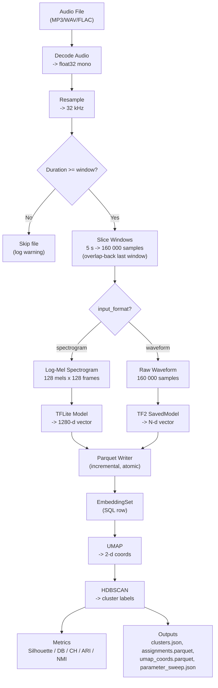

# Humpback Acoustic Embed — Reference Memory

Stable reference material for the humpback acoustic embedding and clustering platform.
This file contains data models, workflows, signal parameters, and storage layouts.
For behavioral rules and development constraints, see `CLAUDE.md`.

---

## Technology Stack

| Layer | Technology |
|-------|-----------|
| Language | Python 3.11+ |
| Package Manager | uv (pyproject.toml + uv.lock) |
| Web Framework | FastAPI |
| Database | SQLite (via SQLAlchemy) |
| Migrations | Alembic |
| Embedding Format | Apache Parquet |
| ML Models | TFLite (Perch), TF2 SavedModel |
| Clustering | HDBSCAN, K-Means, Agglomerative |
| Dim Reduction | UMAP, PCA |
| Metric Learning | PyTorch (triplet loss MLP) |
| Classifier | scikit-learn LogisticRegression |
| Frontend | React 18 + Vite + TypeScript + Tailwind + shadcn/ui |
| Charts | react-plotly.js |
| Server State | TanStack Query |
| Testing | pytest (backend), Playwright (frontend) |

## Repository Layout

```
humpback-acoustic-embed/
├── CLAUDE.md              (behavioral rules — auto-loaded by Claude Code)
├── AGENTS.md              (Codex entry point)
├── MEMORY.md              (this file — reference material)
├── DECISIONS.md           (architecture decision log)
├── STATUS.md              (current project state)
├── PLANS.md               (active development plans)
├── pyproject.toml         (Python dependencies)
├── uv.lock                (lockfile)
├── alembic.ini            (migration config)
├── alembic/versions/      (migration scripts, 001–010)
├── src/humpback/
│   ├── api/               (FastAPI routes)
│   ├── classifier/        (training, detection, embedding)
│   ├── clustering/        (HDBSCAN, K-Means, metrics, refinement)
│   ├── config.py          (settings)
│   ├── database.py        (SQLAlchemy models + session)
│   ├── models/            (TFLite + TF2 model runners)
│   ├── processing/        (audio decode, windowing, features, parquet)
│   ├── schemas/           (Pydantic request/response models)
│   ├── services/          (business logic layer)
│   ├── static/            (built frontend SPA)
│   ├── storage.py         (file path helpers)
│   └── workers/           (background job processing)
├── frontend/              (React SPA — see CLAUDE.md §3.7)
├── tests/                 (pytest suite)
├── models/                (ML model files)
├── scripts/               (utility scripts)
└── data/                  (runtime data)
```

---

## Data Model (Conceptual)

### ModelConfig (model registry) — DB table: model_configs
- id
- name (unique — used as model_version in jobs)
- display_name
- path (relative to project root)
- vector_dim
- description (optional)
- is_default (bool)
- model_type (string: "tflite" | "tf2_saved_model", default "tflite")
- input_format (string: "spectrogram" | "waveform", default "spectrogram")
- created_at, updated_at

Note: `TFLiteModelConfig` is kept as a backward-compatible alias for `ModelConfig`.

### AudioFile
- id
- filename
- folder_path
- source_folder (nullable — absolute path to source directory for imported files; when set, audio is read in-place instead of from `audio/raw/`)
- checksum_sha256
- duration_seconds
- sample_rate_original
- created_at

### AudioMetadata (optional, editable)
- audio_file_id (FK)
- tag_data (JSON)
- visual_observations (JSON)
- group_composition (JSON)
- prey_density_proxy (JSON)

### ProcessingJob
- id
- audio_file_id (FK)
- status: queued | running | complete | failed | canceled
- encoding_signature (unique per audio+config)
- model_version
- window_size_seconds
- target_sample_rate
- feature_config (JSON)
- created_at
- updated_at
- error_message (nullable)

### EmbeddingSet (one per audio+signature)
- id
- audio_file_id (FK)
- encoding_signature (unique)
- model_version
- window_size_seconds
- target_sample_rate
- vector_dim
- parquet_path
- created_at

### ClusteringJob
- id
- status
- embedding_set_ids (JSON array or join table)
- parameters (JSON)
- created_at
- updated_at
- error_message
- metrics_json (JSON, nullable — internal/category metrics computed after clustering)
- refined_from_job_id (nullable — reference to a source ClusteringJob whose refined embeddings to use for re-clustering)

### Cluster
- id
- clustering_job_id
- cluster_label
- size
- metadata_summary (JSON)

### ClusterAssignment
- cluster_id
- embedding_row_id (row index in parquet OR FK to Embedding row table)

Note: do NOT store every embedding vector row in SQL in MVP; store embeddings in Parquet and
only store indexing/assignment references.

### ClassifierModel (binary classifier artifact) — DB table: classifier_models
- id
- name (user-supplied display name)
- model_path (path to .joblib file)
- model_version (embedding model used)
- vector_dim
- window_size_seconds
- target_sample_rate
- feature_config (JSON, nullable)
- training_summary (JSON, nullable — n_pos, n_neg, cv_accuracy, cv_roc_auc)
- training_job_id (nullable)
- created_at, updated_at

### ClassifierTrainingJob — DB table: classifier_training_jobs
- id
- status: queued | running | complete | failed | canceled
- name (for the produced model)
- positive_embedding_set_ids (JSON array)
- negative_embedding_set_ids (JSON array)
- model_version
- window_size_seconds
- target_sample_rate
- feature_config (JSON, nullable)
- parameters (JSON, nullable — C, max_iter, solver)
- classifier_model_id (nullable, set on completion)
- error_message (nullable)
- created_at, updated_at

### DetectionJob — DB table: detection_jobs
- id
- status: queued | running | complete | failed | canceled
- classifier_model_id (FK)
- audio_folder (filesystem path to scan)
- confidence_threshold (float, default 0.5)
- hop_seconds (float, default 1.0 — stride between windows)
- high_threshold (float, default 0.70 — confidence to start an event)
- low_threshold (float, default 0.45 — confidence to continue an event)
- output_tsv_path (nullable, set on completion)
- result_summary (JSON, nullable — n_files, n_windows, n_detections, n_spans, n_skipped_short, hop_seconds, high_threshold, low_threshold)
- error_message (nullable)
- extract_status, extract_error, extract_summary, extract_config (extraction columns)
- created_at, updated_at

---

## Processing Workflow

Input:
- audio file (MP3, WAV, or FLAC)
- optional metadata

Pipeline:
1. Resolve model: if model_version is None, use default from ModelConfig registry
2. Decode audio (MP3/WAV/FLAC)
3. Resample to target sample rate (default: 32000 Hz)
4. Slice into N-second windows (default: 5) using overlap-back strategy (see Windowing Rules below)
5. Branch on model's `input_format`:
   - `"spectrogram"`: Extract log-mel spectrogram (128 mel bins x 128 time frames) -> model.embed()
   - `"waveform"`: Feed raw audio windows directly -> model.embed() (TF2 SavedModel path)
6. Model inference (batched, model resolved from registry by model_version):
   - `model_type="tflite"` -> TFLiteModel (spectrogram input)
   - `model_type="tf2_saved_model"` -> TF2SavedModel (waveform input)
7. Produce embedding vectors (dims from model config)
8. Save embeddings to Parquet (incremental)
9. Persist EmbeddingSet row in SQL
10. Mark ProcessingJob complete

Rules:
- embeddings must be written incrementally (avoid holding all vectors in RAM)
- write parquet to temp path, then atomically rename/move on completion
- job must be restart-safe: if a temp exists, worker may resume or restart cleanly
- if EmbeddingSet exists for encoding_signature and is complete -> skip
- worker caches loaded models in memory to avoid reloading across jobs

### Windowing Rules

Audio is sliced into fixed-length windows using an **overlap-back** strategy instead of zero-padding:

| Scenario | Behavior |
|----------|----------|
| Audio >= 1 window, last chunk is full | Normal: no overlap, no padding |
| Audio >= 1 window, last chunk is partial | **Overlap-back**: shift last window start backward so it ends at the audio boundary, overlapping with the previous window. Contains only real audio. |
| Audio < 1 window (shorter than `window_size_seconds`) | **Skipped entirely**: produces 0 windows, 0 embeddings. A warning is logged. |

**Why not zero-pad?** Zero-padded final windows create out-of-distribution spectrograms that cause false positives in classifiers. The overlap-back strategy ensures every window contains only real audio.

**Minimum audio duration** = `window_size_seconds` (default 5.0 s). Audio files shorter than this threshold are skipped by:
- `slice_windows()` / `slice_windows_with_metadata()` — yield nothing
- `count_windows()` — returns 0
- Processing worker — logs warning, writes empty embedding set
- Detection worker — logs warning, increments `n_skipped_short` in summary
- Trainer (`embed_audio_folder`) — logs warning, skips file

`WindowMetadata` carries `is_overlapped: bool` to flag overlap-back windows (replacing the former `is_padded` field).

### Processing Pipeline Diagram



### Signal Processing Parameters

| Parameter | Default | Description |
|-----------|---------|-------------|
| `target_sample_rate` | 32 000 Hz | Resample target for all audio |
| `window_size_seconds` | 5.0 s | Window duration (= 160 000 samples at 32 kHz) |
| `n_mels` | 128 | Mel frequency bins |
| `n_fft` | 2048 | FFT window size |
| `hop_length` | 1252 | STFT hop (chosen so 160 000 samples -> 128 frames) |
| `target_frames` | 128 | Time frames per spectrogram (pad/truncate) |
| Spectrogram shape | 128 x 128 | (n_mels x target_frames) |
| `vector_dim` | 1280 | Embedding dimensions (Perch default) |
| `batch_size` | 100 | Parquet writer flush interval |
| UMAP `n_neighbors` | 15 | UMAP neighbor count |
| UMAP `min_dist` | 0.1 | UMAP minimum distance |
| `umap_cluster_n_components` | 5 | UMAP dimensions for HDBSCAN input (visualization always 2D) |
| `cluster_selection_method` | leaf | HDBSCAN selection: 'leaf' (fine-grained) or 'eom' (coarser) |
| HDBSCAN `min_cluster_size` | 5 | Minimum points per cluster |
| `clustering_algorithm` | hdbscan | `"hdbscan"`, `"kmeans"`, or `"agglomerative"` |
| `n_clusters` | 15 | For kmeans/agglomerative |
| `linkage` | ward | For agglomerative: `"ward"`, `"complete"`, `"average"`, `"single"` |
| `reduction_method` | umap | `"umap"`, `"pca"`, or `"none"` |
| `distance_metric` | euclidean | `"euclidean"` or `"cosine"` (passed to UMAP + HDBSCAN) |
| `normalization` | per_window_max | Spectrogram normalization: `"per_window_max"`, `"global_ref"`, `"standardize"` (in feature_config) |
| Parameter sweep range | 2-50 | Sweeps HDBSCAN (min_cluster_size x selection_method) + K-Means (k=2..30) |
| `tf_force_cpu` | `false` | Force CPU for TF2 SavedModel inference, skipping GPU (env: `HUMPBACK_TF_FORCE_CPU`) |
| `run_classifier` | `false` | Opt-in: run logistic regression classifier baseline on category labels |
| `stability_runs` | 0 | Opt-in: number of stability re-runs (>= 2 to enable); re-clusters with different random seeds |
| `enable_metric_learning` | `false` | Opt-in: train MLP projection head via triplet loss, re-cluster, compare metrics |
| `ml_output_dim` | 128 | Metric learning: projection output dimensionality |
| `ml_hidden_dim` | 512 | Metric learning: hidden layer dimensionality |
| `ml_n_epochs` | 50 | Metric learning: training epochs |
| `ml_lr` | 0.001 | Metric learning: Adam learning rate |
| `ml_margin` | 1.0 | Metric learning: triplet loss margin |
| `ml_batch_size` | 256 | Metric learning: triplets per epoch |
| `ml_mining_strategy` | semi-hard | Metric learning: `"random"`, `"hard"`, or `"semi-hard"` triplet mining |

---

## Clustering Workflow

Input:
- selected embedding sets (must share the same vector_dim)
- optional metadata filters (subset)

Pipeline:
1. Validate all embedding sets share the same vector_dim (reject with error if mismatched)
2. Load embeddings from Parquet
3. Optional dimensionality reduction (UMAP, PCA, or none — controlled by `reduction_method`)
4. Clustering (HDBSCAN, K-Means, or Agglomerative — controlled by `clustering_algorithm`)
5. Persist clusters and assignments
6. Compute per-cluster metadata summaries
7. Compute evaluation metrics (Silhouette, Davies-Bouldin, Calinski-Harabasz)
8. Compute detailed supervised metrics from folder-path-derived category labels:
   ARI, NMI, homogeneity, completeness, v_measure, per-category purity, confusion matrix
9. Run parameter sweep (HDBSCAN: min_cluster_size x selection_method; K-Means: k=2..30)
   with ARI/NMI when category labels available; save to parameter_sweep.json
10. Compute fragmentation report (per-category & per-cluster entropy, Gini, noise rates); save to report.json
11. Opt-in: Classifier baseline (`run_classifier=true`) — logistic regression cross-validation on category labels; save to classifier_report.json + label_queue.json (active learning priority queue)
12. Opt-in: Stability evaluation (`stability_runs>=2`) — re-cluster N times with different random seeds, compute pairwise ARI; save to stability_summary.json
13. Opt-in: Metric learning refinement (`enable_metric_learning=true`) — train 2-layer MLP projection head with triplet loss on labeled embeddings, project all embeddings into refined space, re-cluster with same params, compare base vs refined metrics; save to refinement_report.json + refined_embeddings.parquet
14. If `refined_from_job_id` is set, load refined embeddings from source job instead of raw embeddings
15. Persist metrics as metrics_json on ClusteringJob
16. Mark ClusteringJob complete

### Original vs Refined Embeddings

Original embeddings (1280-d) come from the pre-trained model and capture general
acoustic features. Refined embeddings (128-d by default) are produced by projecting
the originals through a triplet-loss-trained MLP that pulls same-category embeddings
closer and pushes different categories apart, using folder-path-derived labels.

The refinement pipeline: extract labeled subset (categories with >=5 samples) -> train
`1280->512->128` MLP with triplet loss -> project *all* embeddings -> L2 normalize ->
save as `refined_embeddings.parquet`. Setting `refined_from_job_id` on a new
clustering job loads these refined vectors instead of the originals for full
re-clustering. Training uses GPU when available (`HUMPBACK_TF_FORCE_CPU` to override).

---

## Workflow Queue

Use SQL-backed queue semantics:
- Workers claim queued jobs via atomic compare-and-set updates (`WHERE id=:candidate AND status='queued'`)
- Status transitions:
  - queued -> running -> complete
  - queued -> running -> failed
  - queued -> canceled

Concurrency:
- prevent two running ProcessingJobs for same encoding_signature
- allow multiple clustering jobs in parallel (configurable)

Worker priority order: processing -> clustering -> classifier training -> detection

Queue safety note:
- SQLite has no true row-level locks; correctness relies on atomic status updates,
  not `SELECT ... FOR UPDATE`.

---

## API Validation Contracts

- `POST /processing/jobs` requires an existing `audio_file_id` (missing ID -> 404).
- `POST /clustering/jobs` requires `embedding_set_ids` to be non-empty.
- `POST /classifier/hydrophone-detection-jobs` requires
  `hop_seconds <= classifier window_size_seconds`.
- Hydrophone timeline folder discovery starts at the requested range and expands
  backward in configurable hour increments (default 4h) up to configurable
  max lookback (default 168h) until overlap at the requested start boundary is
  found; timeline clipping remains authoritative for
  `[start_timestamp, end_timestamp]`.
- Hydrophone detection jobs with no overlapping stream audio in the requested
  range fail explicitly (status `failed`) with a user-visible error message.
- `PUT /classifier/detection-jobs/{id}/labels` accepts only `0`, `1`, or null per label field.
- `GET /classifier/detection-jobs/{id}/audio-slice` (hydrophone jobs) resolves slices using a
  range-bounded stream timeline (playlist durations + numeric segment ordering), with legacy
  fallback to `job.start_timestamp` for older jobs.
- Hydrophone labeled-sample extraction (`POST /classifier/detection-jobs/extract` on hydrophone
  jobs) is local-cache-authoritative (same cache root precedence as playback) and does not call S3;
  rows missing local cache audio are skipped and counted in `n_skipped`.
- `GET /audio/{id}/download` returns 416 for malformed/unsatisfiable `Range` headers.

---

## Storage Layout

```
/audio/
  raw/{audio_file_id}/original.(wav|mp3|flac)    (uploaded files only; imported files are read from source_folder)
/embeddings/
  {model_version}/{audio_file_id}/{encoding_signature}.parquet
  {model_version}/{audio_file_id}/{encoding_signature}.tmp.parquet
/clusters/
  {clustering_job_id}/clusters.json
  {clustering_job_id}/assignments.parquet
  {clustering_job_id}/umap_coords.parquet
  {clustering_job_id}/parameter_sweep.json
  {clustering_job_id}/report.json                (fragmentation report)
  {clustering_job_id}/classifier_report.json     (opt-in classifier baseline)
  {clustering_job_id}/label_queue.json           (opt-in active learning queue)
  {clustering_job_id}/stability_summary.json     (opt-in stability evaluation)
  {clustering_job_id}/refinement_report.json     (opt-in metric learning refinement)
  {clustering_job_id}/refined_embeddings.parquet (opt-in refined embedding vectors for re-clustering)
/classifiers/
  {classifier_model_id}/model.joblib              (StandardScaler + LogisticRegression pipeline)
  {classifier_model_id}/training_summary.json
/detections/
  {detection_job_id}/detections.tsv               (local: filename/start/end/confidence fields; hydrophone adds extract_filename)
  {detection_job_id}/run_summary.json
```

Hydrophone labeled-sample extraction output layout:
- Positive labels: `{positive_sample_path}/{hydrophone_id}/humpback/YYYY/MM/DD/{start}_{end}.wav`
- Negative labels: `{negative_sample_path}/{hydrophone_id}/{ship|background}/YYYY/MM/DD/{start}_{end}.wav`
- Local (non-hydrophone) extraction remains unchanged (`{positive_sample_path}/humpback/...`, `{negative_sample_path}/{ship|background}/...`)

---

## Web UI Requirements

Processing:
- Upload audio
- Attach/edit metadata
- Queue processing job
- Monitor status and progress
- Audio detail: show file info, processing history, embedding set(s)

Clustering:
- Select embedding sets
- Configure clustering parameters
- Queue clustering job
- Monitor status
- Cluster detail: members and metadata distributions

Binary Classifier:
- Train tab: select positive and negative embedding sets, name the model, queue training job
- Detect tab: select trained model, specify audio folder to scan (with folder browser dialog), set confidence threshold, queue detection job
- Monitor training and detection job status with polling
- Download detection TSV results
- Training jobs & trained models displayed in table layout with checkbox selection and bulk delete (training job delete cascade-deletes associated model)
- Detection jobs displayed in table layout with checkbox selection and bulk delete
- Expandable detection job rows show sortable TSV detection data (default: avg_confidence desc)
- Inline audio playback of detected segments via streaming WAV slice endpoint
- Hydrophone tab Extract button activates from saved labels on the expanded completed job
- Hydrophone Detection Range displays extraction-aligned UTC span; raw detection range remains visible as secondary audit context
- Hydrophone detection content table uses `Duration` (window-snapped extraction length) instead of raw start/end columns
- Server-side folder browser endpoint (`GET /classifier/browse-directories`) for selecting negative audio and detection audio folders

Editing:
- Manage/edit AudioMetadata associated with audio file
