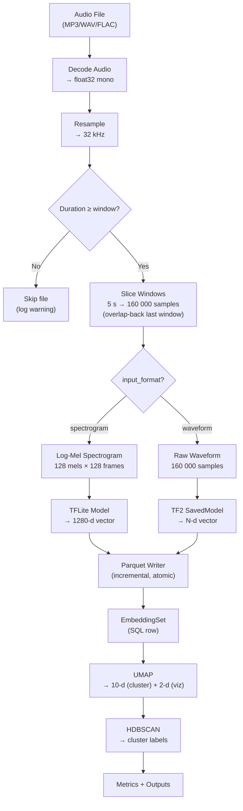

# Humpback Acoustic Embedding & Clustering System

## Overview

This platform supports research on humpback and other whale vocalizations by
turning raw recordings into reusable embeddings, then using those embeddings
for clustering, evaluation, and classifier training. It works with
Perch-compatible TFLite spectrogram models and TensorFlow 2 SavedModels such
as SurfPerch, and keeps processing local with SQL-backed job state and
Parquet-based artifacts.

Researchers can import or reference MP3/WAV/FLAC collections, generate
embeddings, inspect cluster structure, train binary detectors, and run those
detectors on archived hydrophone audio from sources such as Orcasound and
metadata-backed NOAA GCS archives including SanctSound Channel Islands,
Olympic Coast, and Glacier Bay
Bartlett Cove. The web UI and REST API support review, labeling, playback,
spectrogram inspection, and extraction of labeled clips with sibling
spectrogram PNGs for iterative retraining.

Highlights:
- Async, restart-safe job workflows with idempotent encoding
- Multi-model support for TFLite spectrogram models and TF2 waveform models
- Clustering, evaluation, and optional metric-learning refinement workflows
- Binary classifier training plus hydrophone/archive detection
- Autoresearch candidate import, review, and exact-replay promotion into classifier training
- Multi-label vocalization type classifier with managed vocabulary, per-type thresholds, and inference scoring
- Interactive web UI and REST API for review, labeling, and extraction
- Local-first artifact storage using SQL and Parquet-backed outputs
- Zoomable timeline viewer for hydrophone detection jobs (Pattern Radio-inspired, 6 zoom levels, Ocean Depth colormap, startup-scoped tile warming, synchronized audio playback)

---

## Quick Start

### Requirements

#### SurfPerch TensorFlow 2 Model

Download https://www.kaggle.com/models/google/surfperch and place in /models folder


### Install

Requires Python 3.11 or 3.12 and [uv](https://docs.astral.sh/uv/), plus Node.js 18+ for the frontend.

```bash
# Backend (Apple Silicon macOS)
uv sync --group dev --extra tf-macos

# Backend (Linux CPU)
uv sync --group dev --extra tf-linux-cpu

# Backend (Linux GPU / CUDA)
uv sync --group dev --extra tf-linux-gpu

uv run pre-commit install   # one-time per clone

# Frontend
cd frontend && npm install
```

TensorFlow extras are mutually exclusive. Select exactly one of
`tf-macos`, `tf-linux-cpu`, or `tf-linux-gpu` for each environment; do not use
`uv sync --all-extras`.

The backend dev environment includes Ruff, Pyright, pytest, and pre-commit.

### Development Mode

Start all three processes with a single command:

```bash
make dev
```

This runs `honcho start -f Procfile.dev`, launching:
- `api      |` — FastAPI/uvicorn on :8000
- `worker   |` — background job worker
- `frontend |` — Vite dev server on :5173 (hot reload, proxies API to :8000)

Press Ctrl+C to stop all processes cleanly.

Open http://localhost:5173 for the dev UI. API docs at http://localhost:8000/docs.

**Run individual processes:**

```bash
make api           # API only
make worker        # Worker only
make frontend-dev  # Frontend dev server only
```

**First-time frontend setup** (if `frontend/node_modules/` is missing):

```bash
make frontend-install
```

**All available targets:**

```bash
make help
```

**Manual three-terminal approach also works:**

```bash
uv run humpback-api                # Terminal 1
uv run humpback-worker             # Terminal 2
cd frontend && npm run dev         # Terminal 3
```

### Production Build

Build the frontend and serve everything from the API server on a single port:

```bash
cd frontend && npm run build   # outputs to src/humpback/static/dist/
uv run humpback-api            # serves SPA + API on :8000
```

Open http://localhost:8000 — the FastAPI server serves the built SPA at `/` and
the API at their usual paths. When `static/dist/` is not present, it falls back
to the legacy `static/index.html`.

Deployment-specific runtime settings should live in a repo-root `.env` copied
from [`.env.example`](/Users/michael/development/humpback-acoustic-embed/.env.example).
The `humpback-api` and `humpback-worker` entrypoints load that absolute
repo-root file explicitly, and [`scripts/deploy.sh`](/Users/michael/development/humpback-acoustic-embed/scripts/deploy.sh)
sources the same file before resolving `TF_EXTRA`. Direct `Settings()`
construction remains hermetic and does not read cwd `.env` files. For
Cloudflare tunnel access, keep `HUMPBACK_API_HOST=0.0.0.0` and set
`HUMPBACK_ALLOWED_HOSTS=*.trycloudflare.com,localhost,127.0.0.1`. Production
host validation is enforced in FastAPI; Vite `allowedHosts` is only relevant to
`npm run dev`.

For Linux GPU deployments that do not need developer tools, use
`uv sync --extra tf-linux-gpu`.

If you want to manage the API and worker with Supervisor on the host, install it
with:

```bash
uv tool install supervisor
```

The checked-in [`supervisord.conf`](/Users/michael/development/humpback-acoustic-embed/supervisord.conf)
manages only `humpback-api` and `humpback-worker`. Build the frontend during
deploy with `cd frontend && npm ci && npm run build`, then let the API serve the
compiled SPA.

---

## Architecture

### Processing Workflow


```mermaid
flowchart TD
    A["Audio File<br/>(MP3/WAV/FLAC)"] --> B["Decode Audio<br/>→ float32 mono"]
    B --> C["Resample<br/>→ 32 kHz"]
    C --> D{"Duration ≥ window?"}
    D -- No --> D2["Skip file<br/>(log warning)"]
    D -- Yes --> D3["Slice Windows<br/>5 s → 160 000 samples<br/>(overlap-back last window)"]
    D3 --> E{input_format?}
    E -- spectrogram --> F["Log-Mel Spectrogram<br/>128 mels × 128 frames"]
    E -- waveform --> G["Raw Waveform<br/>160 000 samples"]
    F --> H["TFLite Model<br/>→ 1280-d vector"]
    G --> I["TF2 SavedModel<br/>→ N-d vector"]
    H --> J["Parquet Writer<br/>(incremental, atomic)"]
    I --> J
    J --> K["EmbeddingSet<br/>(SQL row)"]
    K --> L["UMAP<br/>→ 10-d (cluster) + 2-d (viz)"]
    L --> M["HDBSCAN<br/>→ cluster labels"]
    M --> N["Metrics + Outputs"]
```

#### Key Signal Processing Parameters

| Parameter | Default | Notes |
|-----------|---------|-------|
| Sample rate | 32 kHz | Resample target |
| Window size | 5 s (160k samples) | Fixed-length, overlap-back last window (no zero-padding). Files shorter than window size are skipped. |
| Spectrogram | 128 mels × 128 frames | n_fft=2048, hop=1252 |
| Embedding dim | 1280 | Perch default |
| UMAP cluster dims | 5 | `umap_cluster_n_components` — clustering input; viz always 2D |
| Clustering algorithm | hdbscan | `clustering_algorithm`: `"hdbscan"`, `"kmeans"`, `"agglomerative"` |
| n_clusters | 15 | For kmeans/agglomerative |
| Linkage | ward | For agglomerative: `"ward"`, `"complete"`, `"average"`, `"single"` |
| Reduction method | umap | `reduction_method`: `"umap"`, `"pca"`, `"none"` |
| Distance metric | euclidean | `distance_metric`: `"euclidean"` or `"cosine"` |
| HDBSCAN selection | leaf | `cluster_selection_method` — 'leaf' (fine-grained) or 'eom' (coarser) |
| HDBSCAN min_cluster_size | 5 | Swept 2–50 for param search |
| Normalization | per_window_max | Spectrogram normalization in feature_config: `"per_window_max"`, `"global_ref"`, `"standardize"` |
| `run_classifier` | false | Opt-in classifier baseline on category labels |
| `stability_runs` | 0 | Opt-in stability evaluation (≥ 2 to enable) |
| `enable_metric_learning` | false | Opt-in triplet-loss MLP refinement |
| `ml_output_dim` | 128 | Metric learning projection output dim |
| `ml_n_epochs` | 50 | Metric learning training epochs |
| `ml_mining_strategy` | semi-hard | Triplet mining: `"random"`, `"hard"`, `"semi-hard"` |

Encoding is associated with the audio file and configuration. Reprocessing is
skipped when an EmbeddingSet with the same encoding_signature already exists.

**Minimum audio duration:** Audio files shorter than `window_size_seconds` (default
5.0 s) are skipped entirely — they produce 0 windows and 0 embeddings. When the last
chunk of a longer file is shorter than a full window, it is shifted backward
(overlap-back) so the window ends at the audio boundary and contains only real audio,
avoiding the false positives caused by zero-padding.

### Model Registry

Multiple models can be registered and managed via the Admin tab or API. Supported
model types:
- **TFLite** (`model_type="tflite"`, `input_format="spectrogram"`): Standard TFLite models
  that take log-mel spectrogram input
- **TF2 SavedModel** (`model_type="tf2_saved_model"`, `input_format="waveform"`): TensorFlow 2
  SavedModel directories that take raw audio waveform input (e.g., SurfPerch)

A default model is seeded on first startup (`multispecies_whale_fp16`). When
creating a processing job, if no `model_version` is specified, the default
registered model is used. The worker resolves the model path, vector
dimensions, model type, and input format from the registry, caching loaded
models across jobs. The scan endpoint detects both `.tflite` files and
directories containing `saved_model.pb`.

Clustering validates that all selected embedding sets share the same vector
dimensions to prevent mixing incompatible embeddings.

### Apple Silicon GPU Acceleration (Metal)

TF2 SavedModel inference runs on the Metal GPU on Apple Silicon Macs. This
required solving a compatibility issue: JAX-exported SavedModels (like
SurfPerch) embed `_XlaMustCompile` attributes in their graph, which force XLA
compilation. Apple's `tensorflow-metal` plugin has no XLA backend, so these
models fail on GPU even though every individual op (Conv2D, MatMul, RFFT, etc.)
is natively supported by Metal.

**How it works:**

1. At model load time, the system inspects the SavedModel's protobuf for
   `_XlaMustCompile` attributes
2. If found, it creates a patched copy of the model (`<model_dir>-no-xla-compile`)
   with the attribute stripped — variable shards are hard-linked to avoid
   doubling disk usage
3. The patched model is loaded on GPU and validated against a CPU baseline using
   deterministic test inputs (tolerance: atol=1e-4, rtol=1e-3)
4. If GPU validation passes, all inference runs on Metal GPU; if it fails, the
   system falls back to CPU automatically and sets `gpu_failed=True` so the UI
   can surface a warning

The patched model copy is created once and reused across worker restarts. To
force CPU-only inference (skipping GPU entirely), set `HUMPBACK_TF_FORCE_CPU=true`.

Hydrophone detection jobs that use TF2 SavedModel embeddings run that inference
path in a short-lived subprocess. This keeps the long-lived worker from
accumulating TensorFlow/Metal state across jobs while preserving the existing
progress, alert, pause/resume, and cancellation behavior in the parent worker.

**Typical startup log (GPU success):**

```
INFO: Model at models/surfperch-tensorflow2 contains _XlaMustCompile (JAX/XLA model). Patching for Metal GPU compatibility.
INFO: Stripping _XlaMustCompile from models/surfperch-tensorflow2 → models/surfperch-tensorflow2-no-xla-compile
INFO: Stripped 3 _XlaMustCompile attribute(s)
INFO: GPU validation passed. Using GPU device: /device:GPU:0
```

### Clustering Workflow

```
selected embedding sets (must share vector_dim)
  → load from Parquet
  → dimensionality reduction (UMAP, PCA, or none)
  → clustering (HDBSCAN, K-Means, or Agglomerative)
  → persist clusters + assignments
  → compute evaluation metrics (Silhouette, Davies-Bouldin, Calinski-Harabasz)
  → compute detailed supervised metrics (ARI, NMI, homogeneity, completeness, v-measure, per-category purity, confusion matrix)
  → run parameter sweep (HDBSCAN + K-Means, with ARI/NMI when categories available)
  → compute fragmentation report (per-category & per-cluster entropy, Gini, noise rates)
  → [opt-in] classifier baseline (logistic regression CV + active learning queue)
  → [opt-in] stability evaluation (N re-runs with different seeds, pairwise ARI)
  → [opt-in] metric learning refinement (triplet-loss MLP → re-cluster → compare)
```

### Clustering Analysis & Evaluation

After clustering completes, the system produces a suite of analysis outputs. Some
run automatically; others are opt-in via job parameters. All results are available
through the API and displayed in the Evaluation Panel in the UI.

#### Internal Metrics (always computed)

| Metric | What it measures | Higher or lower is better |
|--------|-----------------|--------------------------|
| **Silhouette Score** | How similar each point is to its own cluster vs the nearest other cluster (−1 to 1) | Higher |
| **Davies-Bouldin Index** | Average similarity between each cluster and its most similar cluster | Lower |
| **Calinski-Harabasz Score** | Ratio of between-cluster to within-cluster dispersion | Higher |

These metrics are *unsupervised* — they evaluate clustering structure without
needing ground-truth labels.

#### Supervised Metrics (when folder-path category labels exist)

Audio files organized in subfolders (e.g., `Grunt/`, `Upsweep/`, `Buzz/`) are
automatically assigned category labels derived from the deepest folder path component.
When these labels are available, the system computes:

| Metric | What it measures |
|--------|-----------------|
| **ARI** (Adjusted Rand Index) | Agreement between cluster assignments and categories, corrected for chance (−1 to 1, 1 = perfect) |
| **NMI** (Normalized Mutual Info) | Shared information between clusters and categories (0 to 1) |
| **Homogeneity** | Whether each cluster contains only members of a single category |
| **Completeness** | Whether all members of a category are assigned to the same cluster |
| **V-measure** | Harmonic mean of homogeneity and completeness |
| **Per-category purity** | Fraction of each category's samples in its dominant cluster |
| **Confusion matrix** | Full cluster × category count matrix |

**What to do with these:** ARI and NMI tell you how well the embedding space
naturally separates your call types. Low scores suggest the model may not
distinguish these call types well, or that your category labels need refinement.

#### Dendrogram Heatmap

A hierarchical clustering of the confusion matrix, showing which clusters and
categories are most similar. Helps identify cluster merges or splits that might
improve category alignment.

#### Parameter Sweep (always computed)

Automatically sweeps HDBSCAN (`min_cluster_size` 2–50 × `leaf`/`eom`) and K-Means
(`k` 2–30), recording Silhouette score, cluster count, noise fraction, and
ARI/NMI (when labels available) for each configuration.

**What to do with these:** Use the sweep results to find the parameter
configuration that maximizes your metric of interest. If ARI peaks at a different
`min_cluster_size` than Silhouette, it means the "best" clustering depends on
whether you optimize for internal cohesion or category alignment.

#### Fragmentation Report (always computed)

Measures how categories and clusters relate to each other:

- **Per-category fragmentation:** For each category, how many clusters its members
  are spread across. Metrics include normalized entropy (0 = all in one cluster,
  1 = uniformly spread), Gini coefficient, top-k cluster mass, and noise rate.
- **Per-cluster composition:** For each cluster, how mixed its members are across
  categories. Reports the dominant category, its mass fraction, and cluster entropy.
- **Global summary:** Mean entropy, mean N_eff (effective number of clusters per
  category), and overall noise rate.

**What to do with these:** High fragmentation for a category (e.g.,
`normalized_entropy > 0.5`) means that call type is acoustically diverse or the
embedding space doesn't group it tightly. This can guide data collection (get more
examples of fragmented types) or suggest those categories need subcategories.

#### Stability Evaluation (opt-in: `stability_runs ≥ 2`)

Re-runs the full clustering pipeline N times with different random seeds and
measures consistency:

- **Pairwise ARI:** Agreement between every pair of runs (mean, std, min, max).
  High mean ARI (> 0.8) indicates the clustering is robust to random initialization.
- **Aggregate metrics:** Mean/std/min/max of Silhouette, ARI, NMI, noise fraction,
  and cluster count across all runs.
- **Per-run details:** Full metrics for each individual run.

**What to do with these:** If pairwise ARI is low (< 0.5), the clustering is
unstable — results change significantly with different random seeds. Consider using
PCA instead of UMAP (PCA is deterministic), increasing `min_cluster_size`, or
switching to K-Means which is less sensitive to initialization.

#### Classifier Baseline (opt-in: `run_classifier = true`)

Trains a logistic regression classifier via stratified K-fold cross-validation on
the category labels to measure how linearly separable the categories are in the
original embedding space:

- **Overall accuracy, macro/weighted F1:** How well a simple classifier can predict
  categories from embeddings alone.
- **Per-class precision/recall/F1:** Which categories the classifier can and cannot
  distinguish.
- **Confusion matrix:** Which categories get confused with each other.
- **Active learning queue:** Every sample ranked by labeling priority — unlabeled
  samples get the highest priority, followed by high-uncertainty labeled samples
  (measured by classifier entropy and margin), boosted by the category's
  fragmentation score.

**What to do with these:** If classifier accuracy is high (> 0.85), the embedding
space already separates your categories well and clustering issues likely come from
the clustering algorithm or parameters. If accuracy is low, the embedding space
doesn't distinguish your categories — consider metric learning refinement (below),
a different model, or revising your category definitions. The active learning queue
tells you which samples to label next for maximum impact.

#### Metric Learning Refinement (opt-in: `enable_metric_learning = true`)

Trains a 2-layer MLP projection head (`Dense(512, relu) → Dense(128) → L2 normalize`)
using triplet loss on the labeled subset of embeddings, then projects *all*
embeddings through the learned projection and re-clusters:

- **Training summary:** Epochs, learning rate, margin, mining strategy, final loss,
  loss history.
- **Base vs Refined comparison:** Side-by-side table of every metric (Silhouette,
  DB, ARI, NMI, noise fraction, fragmentation index, cluster count) with deltas
  color-coded green (improvement) or red (regression), accounting for metric
  direction (higher-is-better vs lower-is-better).

##### Original vs Refined Embeddings

**Original embeddings** come from the pre-trained model (e.g. Perch). Audio is
sliced into 5-second windows, each window is fed through the model, and you get a
1280-dimensional vector per window. These vectors capture acoustic features learned
during the model's pre-training — general-purpose, not tuned to your category
structure.

**Refined embeddings** are those same vectors run through a small learned projection
that reshapes the space to better match your folder-based category labels:

1. **Labeled subset extraction** — The system derives category labels from each audio
   file's `folder_path` (e.g. `Grunt`, `Upsweep`). Categories with fewer than 5
   samples are excluded; at least 2 viable categories are required.
2. **Triplet training** — A 2-layer MLP (`1280 → 512 → 128`, with ReLU) is trained
   using triplet loss on the labeled subset. Each training step picks triplets of
   (anchor, positive, negative) where anchor/positive share a category and the
   negative doesn't. The loss pushes same-category embeddings closer together and
   different-category embeddings apart in the projected 128-d space.
3. **Project all embeddings** — After training, *every* embedding (labeled or not) is
   passed through the trained MLP and L2-normalized. This produces the refined
   embeddings — same number of rows, but now 128-d instead of 1280-d, in a space
   where your categories are better separated.

| | Original | Refined |
|---|---|---|
| Source | Pre-trained model (Perch) | MLP projection of original |
| Dimensions | 1280 (model default) | 128 (configurable via `ml_output_dim`) |
| Optimized for | General bioacoustic features | Your specific category labels |
| Supervised? | No | Yes (triplet loss on folder labels) |

##### Re-clustering from Refined Embeddings

When metric learning runs, the refined embeddings are saved as
`refined_embeddings.parquet`. The evaluation panel shows a "Re-cluster with Refined
Embeddings" button that creates a new clustering job with `refined_from_job_id`
pointing to the source job. The worker loads the 128-d refined vectors instead of
the 1280-d originals, then runs the full pipeline (UMAP, HDBSCAN/K-Means, metrics,
parameter sweep, etc.) on that improved space. If the refinement comparison showed
better ARI/NMI, the re-clustered results should produce more category-coherent
clusters.

The trade-off: refined embeddings are only as good as your labels. If folder
categories are noisy or incomplete, the projection can overfit to bad signal.

**What to do with these:** If the refined metrics improve (especially ARI/NMI),
the triplet-loss projection is successfully pulling same-category embeddings closer
and pushing different categories apart. This validates that the category structure
exists in the data but wasn't fully captured by the original model. If metrics
don't improve or worsen, the original embedding space may already be near-optimal
for these categories, or more labeled data is needed.

##### Triplet Mining Strategies

- **random:** Fast, good baseline — randomly samples anchor/positive/negative triplets
- **semi-hard** (default): Selects negatives that are closer than the positive but
  within the margin — focuses training on the most informative examples
- **hard:** Picks the closest negative for each anchor — aggressive but can cause
  training instability with noisy labels

Training uses GPU when available (Metal on Apple Silicon), respecting the
`HUMPBACK_TF_FORCE_CPU` env var. Falls back to CPU if no GPU is found.


## API Endpoints

| Method | Path | Description |
|--------|------|-------------|
| POST | `/audio/upload` | Upload audio file (SHA-256 dedup) |
| POST | `/audio/import-folder?folder_path=` | Import audio from local folder by reference (no copy) |
| GET | `/audio/` | List audio files |
| GET | `/audio/{id}` | Get audio file details |
| PUT | `/audio/{id}/metadata` | Update metadata |
| GET | `/audio/{id}/download` | Download original audio file (supports range requests) |
| GET | `/audio/{id}/window` | Get a WAV segment (`?start_seconds=&duration_seconds=`) |
| GET | `/audio/{id}/spectrogram` | Get log-mel spectrogram for a window (`?window_index=`, overlap-back aligned offsets) |
| GET | `/audio/{id}/embeddings` | Get embedding vectors (`?embedding_set_id=`) |
| POST | `/processing/jobs` | Create processing job |
| GET | `/processing/jobs` | List processing jobs |
| GET | `/processing/jobs/{id}` | Get job status |
| POST | `/processing/jobs/{id}/cancel` | Cancel job |
| DELETE | `/processing/jobs/{id}` | Delete processing job |
| POST | `/processing/jobs/bulk-delete` | Bulk delete processing jobs |
| GET | `/processing/embedding-sets` | List embedding sets |
| GET | `/processing/embedding-sets/{id}` | Get embedding set |
| POST | `/clustering/jobs` | Create clustering job |
| GET | `/clustering/jobs/{id}` | Get clustering job |
| DELETE | `/clustering/jobs/{id}` | Delete clustering job |
| GET | `/clustering/jobs/{id}/clusters` | List clusters |
| GET | `/clustering/jobs/{id}/visualization` | Get UMAP scatter plot data |
| GET | `/clustering/jobs/{id}/metrics` | Get cluster evaluation metrics |
| GET | `/clustering/jobs/{id}/parameter-sweep` | Get parameter sweep results |
| GET | `/clustering/jobs/{id}/dendrogram` | Get cluster × category dendrogram heatmap data |
| GET | `/clustering/jobs/{id}/fragmentation` | Get fragmentation report |
| GET | `/clustering/jobs/{id}/stability` | Get stability evaluation results |
| GET | `/clustering/jobs/{id}/classifier` | Get classifier baseline report |
| GET | `/clustering/jobs/{id}/label-queue` | Get active learning priority queue |
| GET | `/clustering/jobs/{id}/refinement` | Get metric learning refinement report |
| GET | `/clustering/clusters/{id}/assignments` | Get assignments |
| POST | `/classifier/training-jobs` | Queue classifier training job |
| POST | `/classifier/autoresearch-candidates/import` | Import an autoresearch artifact bundle for review |
| GET | `/classifier/autoresearch-candidates` | List imported autoresearch candidates |
| GET | `/classifier/autoresearch-candidates/{id}` | Get candidate detail with comparison previews |
| POST | `/classifier/autoresearch-candidates/{id}/training-jobs` | Promote a reviewed candidate into a manifest-backed training job |
| GET | `/classifier/training-jobs` | List training jobs |
| GET | `/classifier/training-jobs/{id}` | Get training job |
| GET | `/classifier/models` | List trained classifier models |
| GET | `/classifier/models/{id}` | Get classifier model details |
| DELETE | `/classifier/models/{id}` | Delete classifier model + files |
| POST | `/classifier/detection-jobs` | Queue detection job (`hop_seconds`, `high_threshold`, `low_threshold`; new jobs are always windowed) |
| GET | `/classifier/detection-jobs` | List detection jobs |
| GET | `/classifier/detection-jobs/{id}` | Get detection job |
| GET | `/classifier/detection-jobs/{id}/download` | Download detections TSV |
| GET | `/classifier/detection-jobs/{id}/content` | Get normalized detection rows as JSON for `running`/`paused`/`complete`/`canceled` jobs when TSV output exists (canonical snapped clip metadata + raw audit fields; hydrophone rows include `detection_filename` with `extract_filename` compatibility alias) |
| GET | `/classifier/detection-jobs/{id}/audio-slice` | Stream WAV slice (`?filename=&start_sec=&duration_sec=`); hydrophone jobs use range-bounded stream-timeline mapping with legacy fallback |
| DELETE | `/classifier/training-jobs/{id}` | Delete training job (cascade-deletes model) |
| POST | `/classifier/training-jobs/bulk-delete` | Bulk delete training jobs |
| DELETE | `/classifier/detection-jobs/{id}` | Delete detection job + output files |
| POST | `/classifier/detection-jobs/bulk-delete` | Bulk delete detection jobs |
| POST | `/classifier/models/bulk-delete` | Bulk delete classifier models |
| GET | `/classifier/browse-directories` | Browse server filesystem directories (`?root=`) |
| GET | `/classifier/models/{id}/retrain-info` | Pre-flight folder info for retrain form |
| POST | `/classifier/retrain` | Create retrain workflow (reimport → process → train) |
| GET | `/classifier/retrain-workflows` | List retrain workflows |
| GET | `/classifier/retrain-workflows/{id}` | Get retrain workflow status |
| GET | `/admin/models` | List registered models |
| POST | `/admin/models` | Register a new model |
| PUT | `/admin/models/{id}` | Update model config |
| DELETE | `/admin/models/{id}` | Delete model (fails if embeddings reference it) |
| POST | `/admin/models/{id}/set-default` | Set model as default |
| GET | `/admin/models/scan` | Scan `models/` dir for unregistered models (.tflite + SavedModel dirs) |
| POST | `/search/similar` | Embedding similarity search — find top-K most similar windows across embedding sets for the same model (cosine or euclidean, brute-force with LRU cache) |
| POST | `/search/similar-by-vector` | Search by raw embedding vector (e.g., from a detection row), same ranking as `/search/similar` |
| POST | `/search/similar-by-audio` | Queue an async search job — worker encodes detection audio via the model and stores the embedding; returns `{id, status: "queued"}` |
| GET | `/search/jobs/{id}` | Poll a search job — returns status while encoding, or search results on completion (ephemeral: row is deleted after results are returned) |
| GET | `/classifier/detection-jobs/{id}/embedding` | Retrieve the stored embedding for a specific detection row (returns vector, model_version, vector_dim) |
| POST | `/classifier/detection-jobs/{id}/timeline/prepare` | Trigger startup-scoped tile warming by default (or explicit full warmup with `{"scope":"full"}`) |
| GET | `/classifier/detection-jobs/{id}/timeline/tile` | Fetch a single pre-colored PNG spectrogram tile (`?zoom_level=&tile_index=`) |
| GET | `/classifier/detection-jobs/{id}/timeline/confidence` | Fetch confidence heatmap data for the timeline viewer |
| GET | `/classifier/detection-jobs/{id}/timeline/audio` | Stream audio segment for the timeline playback (`?start_sec=&duration_sec=`) |
| GET | `/audio/{id}/spectrogram-png` | PNG spectrogram image for a time range of an audio file (disk-cached) |
| POST | `/label-processing/jobs` | Create label processing job (classifier-scored extraction from annotated recordings) |
| GET | `/label-processing/jobs` | List label processing jobs |
| GET | `/label-processing/jobs/{id}` | Get label processing job details |
| DELETE | `/label-processing/jobs/{id}` | Delete label processing job + output artifacts |
| GET | `/label-processing/preview` | Dry-run annotation pairing preview (`?annotation_folder=&audio_folder=`) |

Validation and error behavior notes:
- `POST /processing/jobs` returns `404` when `audio_file_id` does not exist.
- `POST /clustering/jobs` requires at least one `embedding_set_id` (`422` on empty list).
- `POST /classifier/detection-jobs` and `POST /classifier/hydrophone-detection-jobs` now create windowed jobs only; sending `detection_mode` is rejected.
- `GET /classifier/hydrophones` is the legacy archive-source list endpoint and now includes the three UI-visible NOAA sources (`sanctsound_ci`, `sanctsound_oc`, and legacy `noaa_glacier_bay`) alongside the Orcasound hydrophones. Hidden site-scoped SanctSound IDs such as `sanctsound_ci01` and `sanctsound_oc01` remain available for scripted workflows.
- Hydrophone detection jobs with no overlapping stream audio fail explicitly (`status=failed`) with a range-specific error message.
- Hydrophone detection summaries include provider/runtime metadata such as
  `provider_mode`, `execution_mode`, end-to-end `avg_audio_x_realtime`,
  `peak_worker_rss_mb`, and `child_pid` (for subprocess-backed TF2 runs).
- `time_covered_sec` reports summed processed audio duration, which can exceed the requested wall-clock range for umbrella archive sources that span overlapping site feeds.
- Legacy merged-mode jobs remain readable (`/download`, `/content`) but reject label saves, row-state edits, and extraction; rerun them in windowed mode first.
- `PUT /classifier/detection-jobs/{id}/labels` only accepts label values `0`, `1`, or `null`.
- `POST /classifier/detection-jobs/extract` accepts optional `positive_selection_smoothing_window`
  (odd integer, default `3`), `positive_selection_min_score` (default `0.70`), and
  `positive_selection_extend_min_score` (default `0.60`). Positive labels seed from the
  best 5-second training window in the stored 1-second-hop detection scores, then may widen
  in adjacent 5-second chunks when the neighboring smoothed score remains above the extension
  threshold; rows are skipped when the peak smoothed score is below threshold. Legacy jobs fall
  back to rescoring.
- Hydrophone extraction reads local HLS cache only for Orcasound jobs, writes FLAC labeled clips,
  over-fetches a small real-audio guard band and hard-trims clips to the expected sample count
  when archive audio exists, skips missing-cache positives via
  `n_positive_selection_skipped`, and never zero-pads genuinely short archive clips. NOAA
  extraction uses direct anonymous GCS fetch instead.
- Processing jobs that are shorter than one full window persist sample-precise warnings with
  sample counts and high-precision durations instead of rounded `5.0s < 5.0s` messages.
- `GET /audio/{id}/download` returns `416` for malformed or unsatisfiable `Range` headers.
- Completed detection jobs keep a canonical `detection_rows.parquet` row store beside the TSV
  output. Detection-time auto-selection metadata is persisted there, TSV download is generated
  from that row store, and `PUT /classifier/detection-jobs/{id}/row-state` can atomically
  persist one row's labels plus manual positive-window bounds.

### Autoresearch Candidate Promotion

The Classifier Training page now supports two distinct ways to produce a new model:

- **Embedding-set training** is the original path: choose positive and negative embedding sets and queue a training job directly.
- **Autoresearch candidate promotion** imports a reviewed artifact bundle (`manifest.json`, `best_run.json`, optional comparison JSON, optional `top_false_positives.json`) and, when the config is exactly reproducible, starts a manifest-backed training job from the candidate's `train` split.

Candidate promotion is intended for reviewed search winners compared against production models such as `LR-v12`. The Training tab surfaces:

- source model and phase
- split-level metric deltas versus production
- disagreement previews and top false positives
- reproducibility warnings that explain why a candidate is `promotable` or `blocked`

Current promotion limits:

- promotable: `logreg` and `mlp`, `feature_norm` in `none|l2|standard`, `context_pooling=center`, `prob_calibration=none`, `pca_dim=null`, `hard_negative_fraction=0.0`
- blocked: pooled contexts (`mean3`, `max3`), calibrated probabilities, PCA, replay-adjusted hard negatives, unsupported classifier families, and explicit MLP class weights other than `1.0`

Candidate-backed promotion is not the same as legacy retrain-from-folders:

- **Retrain-from-folders** reimports the original positive and negative folder roots for an existing embedding-set-backed model, reprocesses audio, and trains again.
- **Candidate-backed promotion** trains directly from the imported manifest examples and preserves candidate comparison provenance on the resulting model. Because it is manifest-backed rather than folder-backed, these promoted models do not currently support the folder-root retrain workflow.

---

## Storage Layout

```
data/
  audio/raw/{audio_file_id}/original.(wav|mp3|flac)
  embeddings/{model_version}/{audio_file_id}/{encoding_signature}.parquet
  clusters/{clustering_job_id}/clusters.json
  clusters/{clustering_job_id}/assignments.parquet
  clusters/{clustering_job_id}/umap_coords.parquet
  clusters/{clustering_job_id}/parameter_sweep.json
  clusters/{clustering_job_id}/report.json                (fragmentation)
  clusters/{clustering_job_id}/classifier_report.json     (opt-in)
  clusters/{clustering_job_id}/label_queue.json           (opt-in)
  clusters/{clustering_job_id}/stability_summary.json     (opt-in)
  clusters/{clustering_job_id}/refinement_report.json     (opt-in)
  clusters/{clustering_job_id}/refined_embeddings.parquet (opt-in, for re-clustering)
  classifiers/{classifier_model_id}/model.joblib         (binary classifier pipeline)
  classifiers/{classifier_model_id}/training_summary.json
  detections/{detection_job_id}/detection_rows.parquet    (canonical editable row store; row_id + labels + detection-time auto selections + manual overrides + effective positive-selection provenance + extraction artifact filename)
  detections/{detection_job_id}/detections.tsv            (download/export view synchronized from detection_rows.parquet; hydrophone rows include detection_filename + extract_filename alias)
  detections/{detection_job_id}/window_diagnostics.parquet (local jobs: single Parquet file; hydrophone jobs: shard directory)
  detections/{detection_job_id}/run_summary.json
```

Labeled-sample extraction outputs:
- local jobs: `{positive|negative}_sample_path/{label}/YYYY/MM/DD/*.flac`
- hydrophone jobs: `{positive|negative}_sample_path/{label}/{hydrophone_id}/YYYY/MM/DD/*.flac`
- every extracted audio file also writes a same-basename `.png` spectrogram sidecar in
  the same directory, rendered from the extracted clip window rather than the full
  detection span
- hydrophone extraction hard-trims repaired/current clips to the expected sample count when
  the archive contains enough real audio; it never pads silence to manufacture a full window
- Positive extraction writes the classifier-selected 5-second seed window plus any adjacent
  5-second extensions that pass the configured support threshold (`positive_extract_filename`);
  negative extraction keeps the labeled clip bounds.

## Utilities

`uv run python scripts/convert_audio_to_flac.py <path> [<path> ...]` converts `.wav` and `.mp3` files to sibling `.flac` files in place. Use `--verify-samples` to compare decoded source/output audio and fail if the sample rate, sample count, or max absolute error exceeds the built-in tolerance.

`uv run python scripts/repair_hydrophone_extract_lengths.py` dry-runs imported hydrophone
extracts whose compact UTC clip filenames span the configured 5-second window but whose stored
audio is still short by `1..64` samples. It also fixes legacy hydrophone extracts whose files
still end in `.wav` even though their on-disk bytes are FLAC. Add `--apply` to rewrite the FLAC,
regenerate the PNG sidecar, and refresh the matching `audio_files` metadata.

---

## Testing

### Lint and format checks (required before commit)

```bash
uv run pre-commit run --all-files
```

Commits run Ruff and Pyright automatically for Python/tooling changes. If Ruff
auto-fixes files, re-stage those files and commit again.

### Type checking

```bash
uv run pyright
```

Pyright is enforced for `src/humpback`, `scripts/`, and `tests/` via the repo
config.

### Run all tests

```bash
uv run pytest tests/
```

### Run with verbose output

```bash
uv run pytest tests/ -v
```

### Run specific test categories

```bash
uv run pytest tests/unit/           # Unit tests only
uv run pytest tests/integration/    # Integration tests only
uv run pytest tests/e2e/            # E2E smoke test
uv run pytest -k <pattern>          # Pattern matching
```

### Watch mode

```bash
uv run ptw
```

### Frontend tests (Playwright)

UI behavior is tested with Playwright. Tests live in `frontend/e2e/` and run against
the dev server (`:5173`) proxying to the backend (`:8000`).

```bash
# One-time setup: install Chromium browser
cd frontend && npx playwright install chromium

# Run all frontend tests (requires backend + frontend dev server running)
cd frontend && npx playwright test

# Run a specific test file
npx playwright test e2e/detection-playback.spec.ts

# Run by test name pattern
npx playwright test -g "audio-slice"

# Run with browser visible (for debugging)
npx playwright test --headed
```

Tests skip gracefully when preconditions aren't met (e.g., no completed detection
jobs in the database).

---

## Agent Workflows

This repo also serves as a structured testbed for agent-assisted development workflows.

The project includes structured workflows for AI coding agents (Claude Code and Codex App). Workflow definitions live in `.agents/skills/` as the single source of truth, with thin wrappers for each platform.

### Claude Code Commands

The project uses the [superpowers](https://github.com/anthropics/claude-code) skill system as its canonical development workflow:

**brainstorming** -> **writing-plans** -> **subagent-driven-development** -> **finishing-a-development-branch**

Design specs are saved to `docs/specs/`, implementation plans to `docs/plans/`.

### Codex App

Codex reads `AGENTS.md` as its entry point, which defines a 6-phase workflow (Context -> Design -> Plan -> Implement -> Verify -> Finish) mirroring the superpowers flow using only Codex-available tools.

### Project Documentation

| File | Purpose |
|------|---------|
| `CLAUDE.md` | Rules, reference material, project state (auto-loaded by Claude Code) |
| `DECISIONS.md` | Architecture decision log (append-only) |
| `AGENTS.md` | Codex entry point with phase-based workflow |
| `docs/specs/` | Design specs from brainstorming |
| `docs/plans/` | Implementation plans + backlog |

---

## Configuration

Environment variables (prefix `HUMPBACK_`):

| Variable | Default | Description |
|----------|---------|-------------|
| `HUMPBACK_DATABASE_URL` | `sqlite+aiosqlite:///data/humpback.db` | Database URL |
| `HUMPBACK_STORAGE_ROOT` | `data` | Root directory for file storage |
| `HUMPBACK_API_HOST` | `0.0.0.0` | Bind host for the FastAPI server |
| `HUMPBACK_API_PORT` | `8000` | Bind port for the FastAPI server |
| `HUMPBACK_ALLOWED_HOSTS` | `*` | Comma-separated trusted Host header patterns (`*.example.com` wildcard syntax) |
| `HUMPBACK_MODEL_VERSION` | `perch_v1` | Model version identifier |
| `HUMPBACK_WINDOW_SIZE_SECONDS` | `5.0` | Audio window size |
| `HUMPBACK_TARGET_SAMPLE_RATE` | `32000` | Target sample rate |
| `HUMPBACK_VECTOR_DIM` | `1280` | Embedding vector dimensions |
| `HUMPBACK_USE_REAL_MODEL` | `true` | Use real TFLite model vs fake |
| `HUMPBACK_MODEL_PATH` | `models/multispecies_whale_fp16_flex.tflite` | Path to TFLite model file (fallback) |
| `HUMPBACK_MODELS_DIR` | `models` | Directory to scan for `.tflite` model files |
| `HUMPBACK_TF_FORCE_CPU` | `false` | Force CPU for TF2 SavedModel inference (skip GPU) |
| `HUMPBACK_POSITIVE_SAMPLE_PATH` | `{storage_root}/labeled/positives` | Default positive labeled-sample extraction root |
| `HUMPBACK_NEGATIVE_SAMPLE_PATH` | `{storage_root}/labeled/negatives` | Default negative labeled-sample extraction root |
| `HUMPBACK_S3_CACHE_PATH` | `{storage_root}/s3-orcasound-cache` | Default Orcasound HLS cache root |
| `HUMPBACK_NOAA_CACHE_PATH` | `{storage_root}/noaa-gcs-cache` | Local cache root for NOAA GCS metadata + cached archive objects |
| `HUMPBACK_HYDROPHONE_TIMELINE_LOOKBACK_INCREMENT_HOURS` | `4` | Backfill step size for hydrophone folder discovery |
| `HUMPBACK_HYDROPHONE_TIMELINE_MAX_LOOKBACK_HOURS` | `168` | Maximum hydrophone folder-discovery backlook window |
| `HUMPBACK_HYDROPHONE_PREFETCH_ENABLED` | `true` | Enable ordered concurrent segment prefetch for hydrophone providers that support raw-byte prefetch (for example Orcasound HLS) |
| `HUMPBACK_HYDROPHONE_PREFETCH_WORKERS` | `4` | Worker threads for hydrophone segment prefetch |
| `HUMPBACK_HYDROPHONE_PREFETCH_INFLIGHT_SEGMENTS` | `16` | Max queued segment fetches ahead of decode |
| `HUMPBACK_TIMELINE_PREPARE_WORKERS` | `2` | Worker threads for bounded startup/full timeline tile preparation |
| `HUMPBACK_TIMELINE_STARTUP_RADIUS_TILES` | `2` | Same-zoom tile radius warmed around the initial timeline viewport |
| `HUMPBACK_TIMELINE_STARTUP_COARSE_LEVELS` | `1` | Number of coarser zoom levels warmed alongside the requested startup zoom |
| `HUMPBACK_TIMELINE_NEIGHBOR_PREFETCH_RADIUS` | `1` | Same-zoom neighbor radius opportunistically warmed after an uncached tile miss |
| `HUMPBACK_TIMELINE_TILE_MEMORY_CACHE_ITEMS` | `256` | In-memory hot tile-byte cache entries layered in front of disk tile cache |
| `HUMPBACK_TIMELINE_MANIFEST_MEMORY_CACHE_ITEMS` | `8` | In-memory reusable HLS timeline manifests kept hot across tile/audio requests |
| `HUMPBACK_TIMELINE_PCM_MEMORY_CACHE_MB` | `128` | Approximate MB budget for decoded/resampled PCM reused across timeline tile/audio requests |

The repo-root `.env` file may also define deploy-time values like `TF_EXTRA`.
Unknown keys are ignored by the app settings loader so one file can configure
both deployment and runtime behavior.

---

## Tech Stack

### Backend
- **API**: Python + FastAPI
- **Queue**: SQL-backed polling queue
- **DB**: SQLite with WAL mode (MVP)
- **Embedding**: TensorFlow Lite + TF2 SavedModel (flex delegate for custom ops; macOS GPU via tensorflow-metal; FakeTFLiteModel/FakeTF2Model for testing)
- **Clustering**: UMAP/PCA + HDBSCAN/K-Means/Agglomerative
- **Storage**: Local filesystem

### Frontend
- **Build**: Vite + TypeScript
- **UI**: React 18 + Tailwind CSS
- **Components**: shadcn/ui (Radix primitives)
- **Server State**: TanStack Query (polling, caching, mutations)
- **Charts**: react-plotly.js (spectrograms, similarity matrices, UMAP scatter, parameter sweep)
- **Icons**: lucide-react
- **API Client**: Hand-rolled typed fetch wrapper (`frontend/src/api/client.ts`)

The frontend lives in `frontend/` at the repo root. In development, Vite runs on
`:5173` and proxies API requests to `:8000`. For production, `npm run build`
outputs to `src/humpback/static/dist/` and the FastAPI server serves the SPA
alongside the API on `:8000`.

No client-side router is used — the UI is tab-based (Audio, Processing,
Clustering, Classifier, Search, Admin) with navigation managed via React Router.
The **Search** tab supports standalone embedding search (pick an embedding set +
window) and detection-sourced search (click "Search Similar" on a detection row
to find similar audio across all embedding sets). Detection search uses async
worker-based encoding so it works on all detection jobs, including those created
before embedding storage was added.

## Acknowledgements

This project leverages open-source tools and datasets provided by the **Orcasound** community. We are grateful for their commitment to open science and marine conservation.

### **Software & Analysis**
We utilized the [ambient-sound-analysis](https://github.com/orcasound/ambient-sound-analysis) repository, which provided the core pipeline for converting historical `.ts` files into compact Power Spectral Density (PSD) grids. 

*   **Original Authors**: Caleb Case, Mitch Haldeman, Grant Savage, Zach Price, Timothy Tan, and Vaibhav Mehrotra.
*   **License**: [MIT License](https://github.com/orcasound/ambient-sound-analysis/blob/main/LICENSE).

### **Data & Training**
Our humpback whale detection/analysis models were trained using the [Humpback Whales Training Data](https://github.com) curated in the Orcadata wiki. This dataset includes:
*   **Acoustic Bouts**: Catalogues of common vocalization types and patterned non-song sequences.
*   **Attribution**: Data provided by the Orcasound and OrcaLab communities, including recordings from the 2020 and 2021 seasons.
