# Humpback Acoustic Embedding & Clustering System

## Overview

This project processes humpback whale audio recordings (MP3/WAV/FLAC) into reusable
embedding vectors using a Perch-compatible TFLite model, then performs clustering
with optional ecological/behavioral metadata.

Key features:
- Asynchronous job queue (SQL-backed, restart-safe)
- Idempotent encoding (no reprocessing for same config)
- Multi-model registry supporting TFLite and TF2 SavedModel formats
- TF2 SavedModel support for raw waveform input (e.g., SurfPerch)
- macOS GPU acceleration via tensorflow-macos/tensorflow-metal
- Embeddings stored in Parquet
- REST API for job management and inspection
- Flexible clustering pipeline: HDBSCAN, K-Means, or Agglomerative with interactive scatter plot visualization
- Dimensionality reduction: UMAP, PCA, or none; euclidean or cosine distance metric
- Quantitative cluster evaluation (Silhouette, Davies-Bouldin, Calinski-Harabasz)
- Detailed supervised metrics (ARI, NMI, homogeneity, completeness, v-measure, per-category purity, confusion matrix) from folder-path-derived category labels
- Automatic parameter sweep (HDBSCAN min_cluster_size × selection_method + K-Means k) with ARI/NMI when categories available
- Spectrogram normalization options (per-window max, global ref, standardize) via feature_config

---

## Quick Start

### Install

Requires Python 3.11+ and [uv](https://docs.astral.sh/uv/).

```bash
uv sync --all-extras
```

### Run the API Server

```bash
uv run humpback-api
# or
uv run python -m humpback
```

API docs available at http://localhost:8000/docs

### Run the Worker

```bash
uv run humpback-worker
```

The worker polls for queued processing and clustering jobs and executes them.

---

## Architecture

### Processing Workflow

```mermaid
flowchart TD
    A["Audio File<br/>(MP3/WAV/FLAC)"] --> B["Decode Audio<br/>→ float32 mono"]
    B --> C["Resample<br/>→ 32 kHz"]
    C --> D["Slice Windows<br/>5 s → 160 000 samples"]
    D --> E{input_format?}
    E -- spectrogram --> F["Log-Mel Spectrogram<br/>128 mels × 128 frames"]
    E -- waveform --> G["Raw Waveform<br/>160 000 samples"]
    F --> H["TFLite Model<br/>→ 1280-d vector"]
    G --> I["TF2 SavedModel<br/>→ N-d vector"]
    H --> J["Parquet Writer<br/>(incremental, atomic)"]
    I --> J
    J --> K["EmbeddingSet<br/>(SQL row)"]
    K --> L["UMAP<br/>→ 10-d (cluster) + 2-d (viz)"]
    L --> M["HDBSCAN<br/>→ cluster labels"]
    M --> N["Metrics + Outputs"]
```



#### Key Signal Processing Parameters

| Parameter | Default | Notes |
|-----------|---------|-------|
| Sample rate | 32 kHz | Resample target |
| Window size | 5 s (160k samples) | Fixed-length, zero-padded |
| Spectrogram | 128 mels × 128 frames | n_fft=2048, hop=1252 |
| Embedding dim | 1280 | Perch default |
| UMAP cluster dims | 5 | `umap_cluster_n_components` — clustering input; viz always 2D |
| Clustering algorithm | hdbscan | `clustering_algorithm`: `"hdbscan"`, `"kmeans"`, `"agglomerative"` |
| n_clusters | 15 | For kmeans/agglomerative |
| Linkage | ward | For agglomerative: `"ward"`, `"complete"`, `"average"`, `"single"` |
| Reduction method | umap | `reduction_method`: `"umap"`, `"pca"`, `"none"` |
| Distance metric | euclidean | `distance_metric`: `"euclidean"` or `"cosine"` |
| HDBSCAN selection | leaf | `cluster_selection_method` — 'leaf' (fine-grained) or 'eom' (coarser) |
| HDBSCAN min_cluster_size | 5 | Swept 2–50 for param search |
| Normalization | per_window_max | Spectrogram normalization in feature_config: `"per_window_max"`, `"global_ref"`, `"standardize"` |

Encoding is associated with the audio file and configuration. Reprocessing is
skipped when an EmbeddingSet with the same encoding_signature already exists.

### Model Registry

Multiple models can be registered and managed via the Admin tab or API. Supported
model types:
- **TFLite** (`model_type="tflite"`, `input_format="spectrogram"`): Standard TFLite models
  that take log-mel spectrogram input
- **TF2 SavedModel** (`model_type="tf2_saved_model"`, `input_format="waveform"`): TensorFlow 2
  SavedModel directories that take raw audio waveform input (e.g., SurfPerch)

A default model is seeded on first startup (`multispecies_whale_fp16`). When
creating a processing job, if no `model_version` is specified, the default
registered model is used. The worker resolves the model path, vector
dimensions, model type, and input format from the registry, caching loaded
models across jobs. The scan endpoint detects both `.tflite` files and
directories containing `saved_model.pb`.

Clustering validates that all selected embedding sets share the same vector
dimensions to prevent mixing incompatible embeddings.

### Clustering Workflow

```
selected embedding sets (must share vector_dim)
  → load from Parquet
  → dimensionality reduction (UMAP, PCA, or none)
  → clustering (HDBSCAN, K-Means, or Agglomerative)
  → persist clusters + assignments
  → compute evaluation metrics (Silhouette, Davies-Bouldin, Calinski-Harabasz)
  → compute detailed supervised metrics (ARI, NMI, homogeneity, completeness, v-measure, per-category purity, confusion matrix)
  → run parameter sweep (HDBSCAN + K-Means, with ARI/NMI when categories available)
```

### Cluster Assignment Playback Controls

When viewing a clustering job's results, expanding a cluster shows its audio
file assignments organized in a folder tree. Each audio file has a compact
playback control bar:

```
┌──────────────────────────────────────────────────────────────────────┐
│ [▶]  [0] [3] [17]  [Full]   🔈▮▮▯▯  ⋯                              │
│ 0:15 [====██████=========================] 0:20                      │
└──────────────────────────────────────────────────────────────────────┘
```

| Control | Description |
|---------|-------------|
| **Play/pause** (▶/⏸) | Plays the currently selected window or full file |
| **Row-index chips** ([0], [3], ...) | Each chip represents a window assigned to this cluster. Click to select and auto-play that window segment |
| **Full** | Switch to full-file playback mode |
| **Volume** (🔈) | Adjusts playback volume |
| **Download** (⋯) | Downloads the original audio file |
| **Time indicator** | Bottom bar shows the selected window's position within the full audio file. The blue region highlights the active segment, and a playhead tracks progress during playback |

When a file has only one window assigned to the cluster, that window is
selected by default (instead of full-file mode) so playback starts on the
relevant segment. The time indicator makes it easy to see where in the
original recording the clustered segment falls.

---

## API Endpoints

| Method | Path | Description |
|--------|------|-------------|
| POST | `/audio/upload` | Upload audio file (SHA-256 dedup) |
| GET | `/audio/` | List audio files |
| GET | `/audio/{id}` | Get audio file details |
| PUT | `/audio/{id}/metadata` | Update metadata |
| GET | `/audio/{id}/download` | Download original audio file (supports range requests) |
| GET | `/audio/{id}/window` | Get a WAV segment (`?start_seconds=&duration_seconds=`) |
| GET | `/audio/{id}/spectrogram` | Get log-mel spectrogram for a window (`?window_index=`) |
| GET | `/audio/{id}/embeddings` | Get embedding vectors (`?embedding_set_id=`) |
| POST | `/processing/jobs` | Create processing job |
| GET | `/processing/jobs` | List processing jobs |
| GET | `/processing/jobs/{id}` | Get job status |
| POST | `/processing/jobs/{id}/cancel` | Cancel job |
| GET | `/processing/embedding-sets` | List embedding sets |
| GET | `/processing/embedding-sets/{id}` | Get embedding set |
| POST | `/clustering/jobs` | Create clustering job |
| GET | `/clustering/jobs/{id}` | Get clustering job |
| GET | `/clustering/jobs/{id}/clusters` | List clusters |
| GET | `/clustering/jobs/{id}/visualization` | Get UMAP scatter plot data |
| GET | `/clustering/jobs/{id}/metrics` | Get cluster evaluation metrics |
| GET | `/clustering/jobs/{id}/parameter-sweep` | Get parameter sweep results |
| GET | `/clustering/clusters/{id}/assignments` | Get assignments |
| GET | `/admin/models` | List registered models |
| POST | `/admin/models` | Register a new model |
| PUT | `/admin/models/{id}` | Update model config |
| DELETE | `/admin/models/{id}` | Delete model (fails if embeddings reference it) |
| POST | `/admin/models/{id}/set-default` | Set model as default |
| GET | `/admin/models/scan` | Scan `models/` dir for unregistered models (.tflite + SavedModel dirs) |

---

## Storage Layout

```
data/
  audio/raw/{audio_file_id}/original.(wav|mp3|flac)
  embeddings/{model_version}/{audio_file_id}/{encoding_signature}.parquet
  clusters/{clustering_job_id}/clusters.json
  clusters/{clustering_job_id}/assignments.parquet
  clusters/{clustering_job_id}/umap_coords.parquet
  clusters/{clustering_job_id}/parameter_sweep.json
```

---

## Testing

### Run all tests

```bash
uv run pytest
```

### Run with verbose output

```bash
uv run pytest -v
```

### Run specific test categories

```bash
uv run pytest tests/unit/           # Unit tests only
uv run pytest tests/integration/    # Integration tests only
uv run pytest tests/e2e/            # E2E smoke test
uv run pytest -k <pattern>          # Pattern matching
```

### Watch mode

```bash
uv run ptw
```

---

## Configuration

Environment variables (prefix `HUMPBACK_`):

| Variable | Default | Description |
|----------|---------|-------------|
| `HUMPBACK_DATABASE_URL` | `sqlite+aiosqlite:///data/humpback.db` | Database URL |
| `HUMPBACK_STORAGE_ROOT` | `data` | Root directory for file storage |
| `HUMPBACK_MODEL_VERSION` | `perch_v1` | Model version identifier |
| `HUMPBACK_WINDOW_SIZE_SECONDS` | `5.0` | Audio window size |
| `HUMPBACK_TARGET_SAMPLE_RATE` | `32000` | Target sample rate |
| `HUMPBACK_VECTOR_DIM` | `1280` | Embedding vector dimensions |
| `HUMPBACK_USE_REAL_MODEL` | `true` | Use real TFLite model vs fake |
| `HUMPBACK_MODEL_PATH` | `models/multispecies_whale_fp16_flex.tflite` | Path to TFLite model file (fallback) |
| `HUMPBACK_MODELS_DIR` | `models` | Directory to scan for `.tflite` model files |

---

## Tech Stack

- **Backend**: Python + FastAPI
- **Queue**: SQL-backed polling queue
- **DB**: SQLite with WAL mode (MVP)
- **Embedding**: TensorFlow Lite + TF2 SavedModel (flex delegate for custom ops; macOS GPU via tensorflow-metal; FakeTFLiteModel/FakeTF2Model for testing)
- **Clustering**: UMAP/PCA + HDBSCAN/K-Means/Agglomerative
- **Storage**: Local filesystem
