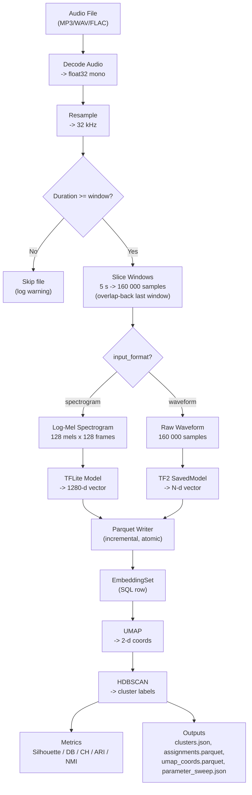

# Superpowers Workflow Adoption — Implementation Plan

> **For agentic workers:** REQUIRED SUB-SKILL: Use superpowers:subagent-driven-development (recommended) or superpowers:executing-plans to implement this plan task-by-task. Steps use checkbox (`- [ ]`) syntax for tracking.

**Goal:** Replace 6 custom session-* skills with the superpowers workflow, consolidate 6 repo-root .md files down to 3, and provide a Codex-compatible workflow in AGENTS.md.

**Architecture:** This is a pure documentation/configuration restructuring — no application code changes. Content from STATUS.md and MEMORY.md is absorbed into CLAUDE.md. Session skills and command wrappers are deleted. AGENTS.md is rewritten for Codex. An ADR is appended to DECISIONS.md.

**Tech Stack:** Markdown files, git

**Spec:** `docs/specs/2026-03-24-superpowers-workflow-adoption-design.md`

---

### Task 1: Infrastructure Setup

**Files:**
- Modify: `.gitignore`
- Create: `docs/plans/backlog.md`

- [ ] **Step 1: Add `.worktrees/` to `.gitignore`**

Open `.gitignore` and append at the end:

```
.worktrees/
```

- [ ] **Step 2: Create `docs/plans/backlog.md` from PLANS.md backlog**

Create `docs/plans/backlog.md` with the backlog items migrated from `PLANS.md`:

```markdown
# Development Backlog

- Agile Modeling Phase 1b: search by uploaded audio clip by embedding the clip on the fly with a selected model, then searching existing embedding sets.
- Agile Modeling Phase 3: connect search-result labeling into classifier training and the retrain loop.
- Agile Modeling Phase 4: prioritize labeling suggestions using model uncertainty signals such as entropy or margin.
- Smoke-test `tf-linux-gpu` on a real Ubuntu/NVIDIA host, including `uv sync --extra tf-linux-gpu`, TensorFlow import, and GPU device visibility.
- Generalize legacy hydrophone API and frontend naming toward archive-source terminology now that NOAA Glacier Bay shares the same backend surfaces.
- Explore GPU-accelerated batch processing for large audio libraries.
- Add WebSocket push for real-time job status updates to replace polling.
- Investigate multi-model ensemble clustering.
- Optimize `/audio/{id}/spectrogram` to avoid materializing all windows when only one index is requested.
- Optimize hydrophone incremental lookback discovery to avoid repeated full S3 folder scans during startup.
- Add an integration and performance harness for hydrophone S3 prefetch so worker defaults can be tuned on real S3-backed runs.
- Investigate a lower-overhead Orcasound decode path, likely chunk-level or persistent-stream decode, and treat it as a signal-processing/runtime change that needs validation plus an ADR.
- Make `hydrophone_id` optional for local-cache detection jobs in the backend API, service layer, and worker.
- Remove vestigial `output_tsv_path` and `output_row_store_path` fields from the detection model, schema, and database via migration.
```

- [ ] **Step 3: Commit**

```bash
git add .gitignore docs/plans/backlog.md
git commit -m "Add .worktrees/ to gitignore and migrate backlog to docs/plans/"
```

---

### Task 2: Update CLAUDE.md Preamble and Section 3.6

**Files:**
- Modify: `CLAUDE.md` (lines 1-91)

- [ ] **Step 1: Replace the preamble (lines 16-28)**

Replace lines 16-28 (the "This document defines..." paragraph, the empty line, the "## Memory Files" heading, and the table) with:

```markdown
This document defines behavioral rules, engineering constraints, project reference
material, and workflow integration. For architecture decisions, see `DECISIONS.md`.
For Codex-specific workflow, see `AGENTS.md`.
```

Remove the blank line and `---` separator that follows the old table if present before section 2.

- [ ] **Step 2: Update section 3.6 Documentation (lines 83-90)**

Replace the content of section 3.6 with:

```markdown
### 3.6 Documentation
*   When a change adds, removes, or modifies API endpoints, data models, configuration options, architecture, or workflows, update the relevant files:
    *   `CLAUDE.md` — rules, reference material, project state (this file)
    *   `DECISIONS.md` — append new ADR for significant architecture changes
    *   `README.md` — user-facing API endpoints, configuration, feature list
    *   `docs/specs/` — design specs (written during brainstorming phase)
    *   `docs/plans/` — implementation plans (written during planning phase)
```

- [ ] **Step 3: Verify the edit**

Run: `head -30 CLAUDE.md`

Expected: the new preamble text, no "Memory Files" table, no references to MEMORY.md/STATUS.md/PLANS.md.

Run: `grep -n "MEMORY.md\|STATUS.md\|PLANS.md" CLAUDE.md`

Expected: no matches (these references should all be gone from sections 1-3).

- [ ] **Step 4: Commit**

```bash
git add CLAUDE.md
git commit -m "Update CLAUDE.md preamble and documentation section for consolidated workflow"
```

---

### Task 3: Add CLAUDE.md Section 8 — Project Reference

**Files:**
- Modify: `CLAUDE.md` (append after section 7)

This is the largest task. It absorbs content from MEMORY.md into a new section 8.

- [ ] **Step 1: Add section 8 header and subsections 8.1-8.2**

Append after the existing section 7 (`## 7. Non-Goals`) and its content. Add:

```markdown

---

## 8. Project Reference

### 8.1 Technology Stack

| Layer | Technology |
|-------|-----------|
| Language | Python 3.11-3.12 |
| Package Manager | uv (pyproject.toml + uv.lock, explicit TensorFlow extras by platform) |
| Web Framework | FastAPI |
| Database | SQLite (via SQLAlchemy) |
| Migrations | Alembic |
| Embedding Format | Apache Parquet |
| ML Models | TFLite (Perch), TF2 SavedModel |
| Clustering | HDBSCAN, K-Means, Agglomerative |
| Dim Reduction | UMAP, PCA |
| Metric Learning | PyTorch (triplet loss MLP) |
| Classifier | scikit-learn LogisticRegression |
| Frontend | React 18 + Vite + TypeScript + Tailwind + shadcn/ui |
| Charts | react-plotly.js |
| Server State | TanStack Query |
| Testing | pytest + pre-commit/Ruff (backend), Playwright (frontend) |

### 8.2 Repository Layout

```
humpback-acoustic-embed/
├── CLAUDE.md              (rules, reference, project state — auto-loaded)
├── AGENTS.md              (Codex entry point)
├── DECISIONS.md           (architecture decision log)
├── pyproject.toml         (Python dependencies)
├── uv.lock                (lockfile)
├── alembic.ini            (migration config)
├── alembic/versions/      (migration scripts, 001–025)
├── src/humpback/
│   ├── api/               (FastAPI routes)
│   ├── classifier/        (training, detection, embedding)
│   ├── clustering/        (HDBSCAN, K-Means, metrics, refinement)
│   ├── config.py          (settings)
│   ├── data/              (packaged metadata assets such as NOAA archive sources)
│   ├── database.py        (SQLAlchemy models + session)
│   ├── models/            (TFLite + TF2 model runners)
│   ├── processing/        (audio decode, windowing, features, parquet)
│   ├── schemas/           (Pydantic request/response models)
│   ├── services/          (business logic layer)
│   ├── static/            (built frontend SPA)
│   ├── storage.py         (file path helpers)
│   └── workers/           (background job processing)
├── frontend/              (React SPA — see §3.7)
├── tests/                 (pytest suite)
├── models/                (ML model files)
├── scripts/               (utility scripts)
├── docs/
│   ├── specs/             (design specs from brainstorming)
│   └── plans/             (implementation plans + backlog)
└── data/                  (runtime data)
```
```

- [ ] **Step 2: Add section 8.3 — Data Model Summary**

Append after section 8.2:

```markdown

### 8.3 Data Model Summary

Condensed model reference. For full field lists, see `src/humpback/database.py`.

- **ModelConfig** (`model_configs`) — ML model registry entry (name, path, vector_dim, model_type, input_format, is_default). `TFLiteModelConfig` is a backward-compatible alias.
- **AudioFile** (`audio_files`) — uploaded/imported audio (filename, folder_path, source_folder, checksum_sha256, duration_seconds, sample_rate_original)
- **AudioMetadata** (`audio_metadata`) — optional editable metadata per audio file (tag_data, visual_observations, group_composition, prey_density_proxy — all JSON)
- **ProcessingJob** (`processing_jobs`) — encoding job (audio_file_id FK, encoding_signature, model_version, window_size_seconds, target_sample_rate, feature_config JSON, status, warning_message)
- **EmbeddingSet** (`embedding_sets`) — one per audio+encoding_signature (parquet_path, model_version, vector_dim). Embeddings stored in Parquet, not SQL.
- **SearchJob** (`search_jobs`) — ephemeral similarity search, deleted after results returned (detection_job_id, top_k, metric, embedding_set_ids, embedding_vector)
- **ClusteringJob** (`clustering_jobs`) — clustering run (embedding_set_ids JSON, parameters JSON, metrics_json, refined_from_job_id)
- **Cluster** (`clusters`) — one per cluster label per job (clustering_job_id FK, cluster_label, size, metadata_summary JSON)
- **ClusterAssignment** (`cluster_assignments`) — links cluster to embedding row index (cluster_id FK, embedding_row_id)
- **ClassifierModel** (`classifier_models`) — binary classifier artifact (name, model_path .joblib, model_version, vector_dim, training_summary JSON)
- **ClassifierTrainingJob** (`classifier_training_jobs`) — training run (positive/negative_embedding_set_ids JSON, classifier_model_id set on completion)
- **DetectionJob** (`detection_jobs`) — local or hydrophone detection scan (classifier_model_id FK, audio_folder, confidence/hop/threshold params, detection_mode, output_tsv_path, result_summary JSON, extract_* columns)
- **LabelProcessingJob** (`label_processing_jobs`) — score-based audio sample extraction (classifier_model_id, annotation_folder, audio_folder, output_root, parameters JSON, result_summary JSON)
- **VocalizationLabel** (`vocalization_labels`) — per-detection vocalization type label (detection_job_id, row_id, label, source)
- **LabelingAnnotation** (`labeling_annotations`) — sub-window annotation boundary (detection_job_id, row_id, start_sec, end_sec, label)
- **RetrainWorkflow** (`retrain_workflows`) — orchestrated reimport+reprocess+retrain (status, step, provenance)
```

- [ ] **Step 3: Add section 8.4 — Signal Processing Parameters**

Append after section 8.3:

```markdown

### 8.4 Signal Processing Parameters

| Parameter | Default | Description |
|-----------|---------|-------------|
| `target_sample_rate` | 32 000 Hz | Resample target for all audio |
| `window_size_seconds` | 5.0 s | Window duration (= 160 000 samples at 32 kHz) |
| `n_mels` | 128 | Mel frequency bins |
| `n_fft` | 2048 | FFT window size |
| `hop_length` | 1252 | STFT hop (chosen so 160 000 samples -> 128 frames) |
| `target_frames` | 128 | Time frames per spectrogram (pad/truncate) |
| Spectrogram shape | 128 x 128 | (n_mels x target_frames) |
| `vector_dim` | 1280 | Embedding dimensions (Perch default) |
| `batch_size` | 100 | Parquet writer flush interval |
| UMAP `n_neighbors` | 15 | UMAP neighbor count |
| UMAP `min_dist` | 0.1 | UMAP minimum distance |
| `umap_cluster_n_components` | 5 | UMAP dimensions for HDBSCAN input (visualization always 2D) |
| `cluster_selection_method` | leaf | HDBSCAN selection: 'leaf' (fine-grained) or 'eom' (coarser) |
| HDBSCAN `min_cluster_size` | 5 | Minimum points per cluster |
| `clustering_algorithm` | hdbscan | `"hdbscan"`, `"kmeans"`, or `"agglomerative"` |
| `n_clusters` | 15 | For kmeans/agglomerative |
| `linkage` | ward | For agglomerative: `"ward"`, `"complete"`, `"average"`, `"single"` |
| `reduction_method` | umap | `"umap"`, `"pca"`, or `"none"` |
| `distance_metric` | euclidean | `"euclidean"` or `"cosine"` (passed to UMAP + HDBSCAN) |
| `normalization` | per_window_max | Spectrogram normalization: `"per_window_max"`, `"global_ref"`, `"standardize"` (in feature_config) |
| Parameter sweep range | 2-50 | Sweeps HDBSCAN (min_cluster_size x selection_method) + K-Means (k=2..30) |
| `tf_force_cpu` | `false` | Force CPU for TF2 SavedModel inference, skipping GPU (env: `HUMPBACK_TF_FORCE_CPU`) |
| `run_classifier` | `false` | Opt-in: run logistic regression classifier baseline on category labels |
| `stability_runs` | 0 | Opt-in: number of stability re-runs (>= 2 to enable); re-clusters with different random seeds |
| `enable_metric_learning` | `false` | Opt-in: train MLP projection head via triplet loss, re-cluster, compare metrics |
| `ml_output_dim` | 128 | Metric learning: projection output dimensionality |
| `ml_hidden_dim` | 512 | Metric learning: hidden layer dimensionality |
| `ml_n_epochs` | 50 | Metric learning: training epochs |
| `ml_lr` | 0.001 | Metric learning: Adam learning rate |
| `ml_margin` | 1.0 | Metric learning: triplet loss margin |
| `ml_batch_size` | 256 | Metric learning: triplets per epoch |
| `ml_mining_strategy` | semi-hard | Metric learning: `"random"`, `"hard"`, or `"semi-hard"` triplet mining |

#### Windowing Rules

Audio is sliced into fixed-length windows using an **overlap-back** strategy instead of zero-padding:

| Scenario | Behavior |
|----------|----------|
| Audio >= 1 window, last chunk is full | Normal: no overlap, no padding |
| Audio >= 1 window, last chunk is partial | **Overlap-back**: shift last window start backward so it ends at the audio boundary, overlapping with the previous window. Contains only real audio. |
| Audio < 1 window (shorter than `window_size_seconds`) | **Skipped entirely**: produces 0 windows, 0 embeddings. A warning is logged. |

**Why not zero-pad?** Zero-padded final windows create out-of-distribution spectrograms that cause false positives in classifiers. The overlap-back strategy ensures every window contains only real audio.

**Minimum audio duration** = `window_size_seconds` (default 5.0 s). Audio files shorter than this threshold are skipped by:
- `slice_windows()` / `slice_windows_with_metadata()` — yield nothing
- `count_windows()` — returns 0
- Processing worker — logs warning, writes empty embedding set
- Detection worker — logs warning, increments `n_skipped_short` in summary
- Trainer (`embed_audio_folder`) — logs warning, skips file

`WindowMetadata` carries `is_overlapped: bool` to flag overlap-back windows (replacing the former `is_padded` field).

#### Processing Pipeline Diagram


```

- [ ] **Step 4: Add sections 8.5-8.7**

Append after section 8.4:

```markdown

### 8.5 Storage Layout

```
/audio/
  raw/{audio_file_id}/original.(wav|mp3|flac)    (uploaded files only; imported files are read from source_folder)
/embeddings/
  {model_version}/{audio_file_id}/{encoding_signature}.parquet
  {model_version}/{audio_file_id}/{encoding_signature}.tmp.parquet
/clusters/
  {clustering_job_id}/clusters.json
  {clustering_job_id}/assignments.parquet
  {clustering_job_id}/umap_coords.parquet
  {clustering_job_id}/parameter_sweep.json
  {clustering_job_id}/report.json                (fragmentation report)
  {clustering_job_id}/classifier_report.json     (opt-in classifier baseline)
  {clustering_job_id}/label_queue.json           (opt-in active learning queue)
  {clustering_job_id}/stability_summary.json     (opt-in stability evaluation)
  {clustering_job_id}/refinement_report.json     (opt-in metric learning refinement)
  {clustering_job_id}/refined_embeddings.parquet (opt-in refined embedding vectors for re-clustering)
/classifiers/
  {classifier_model_id}/model.joblib              (StandardScaler + LogisticRegression pipeline)
  {classifier_model_id}/training_summary.json
/detections/
  {detection_job_id}/detection_rows.parquet       (canonical editable row store)
  {detection_job_id}/detections.tsv               (download/export adapter synchronized from row store)
  {detection_job_id}/window_diagnostics.parquet   (local: single file; hydrophone: shard directory)
  {detection_job_id}/run_summary.json
```

Hydrophone extraction output:
- Positive labels: `{positive_sample_path}/{humpback|orca}/{hydrophone_id}/YYYY/MM/DD/{start}_{end}.flac`
- Negative labels: `{negative_sample_path}/{ship|background}/{hydrophone_id}/YYYY/MM/DD/{start}_{end}.flac`
- Local extraction: same structure without `{hydrophone_id}/` level
- Every `.flac` also gets a same-basename `.png` spectrogram sidecar

### 8.6 Runtime Configuration

- `Settings` reads `HUMPBACK_`-prefixed environment variables.
- API and worker entrypoints load the repo-root `.env`; direct `Settings()` does not.
- `api_host` defaults to `0.0.0.0`, `api_port` to `8000`.
- `allowed_hosts` defaults to `*`. `HUMPBACK_ALLOWED_HOSTS` uses Starlette wildcard syntax.
- `positive_sample_path`, `negative_sample_path`, `s3_cache_path` derive from `storage_root` when unset.

### 8.7 Behavioral Constraints

Non-obvious constraints that are not immediately derivable from code:

- **Worker priority order**: search -> processing -> clustering -> classifier training -> detection -> extraction -> label processing -> retrain
- **Job claim semantics**: Workers claim queued jobs via atomic compare-and-set (`WHERE id=:candidate AND status='queued'`). SQLite has no true row-level locks; correctness relies on atomic status updates, not `SELECT ... FOR UPDATE`.
- **Job status transitions**: `queued -> running -> complete`, `queued -> running -> failed`, `queued -> canceled`
- **Processing concurrency**: prevent two running ProcessingJobs for same encoding_signature; allow multiple clustering jobs in parallel
- **Prefetch semantics**: `time_covered_sec` tracks summed processed audio duration rather than wall-clock range coverage
- **Parquet row-store upgrade**: completed/paused/canceled detection jobs lazily upgrade into a canonical Parquet row store; TSV is synchronized from that store for download/legacy flows
```

- [ ] **Step 5: Verify section 8**

Run: `grep -c "^### 8\." CLAUDE.md`

Expected: `7` (subsections 8.1 through 8.7)

Run: `grep -n "Technology Stack\|Repository Layout\|Data Model Summary\|Signal Processing\|Storage Layout\|Runtime Configuration\|Behavioral Constraints" CLAUDE.md`

Expected: all 7 subsection headings appear.

- [ ] **Step 6: Commit**

```bash
git add CLAUDE.md
git commit -m "Add CLAUDE.md section 8: project reference (absorbed from MEMORY.md)"
```

---

### Task 4: Add CLAUDE.md Section 9 — Current State

**Files:**
- Modify: `CLAUDE.md` (append after section 8)

- [ ] **Step 1: Add section 9**

Append after section 8.7:

```markdown

---

## 9. Current State

### 9.1 Implemented Capabilities

- Audio upload, folder import, metadata editing
- Processing pipeline: TFLite + TF2 SavedModel, overlap-back windowing, incremental Parquet
- Embedding similarity search (cosine/euclidean, cross-set, detection-sourced)
- Clustering: HDBSCAN/K-Means/Agglomerative, UMAP/PCA, parameter sweeps, metric learning
- Binary classifier training (LogisticRegression/MLP) + local/hydrophone detection
- Hydrophone streaming: Orcasound HLS + NOAA archives, pause/resume/cancel, subprocess isolation
- Label processing: score-based + sample-builder workflows
- Vocalization labeling: type classification, active learning, sub-window annotations
- Retrain workflow: reimport -> reprocess -> retrain
- Web UI: routed SPA with Audio, Processing, Clustering, Classifier, Search, Label Processing, Admin

### 9.2 Database Schema

- **Engine**: SQLite via SQLAlchemy
- **Latest migration**: `025_normalize_sanctsound_source_ids.py`
- **Tables**: model_configs, audio_files, audio_metadata, processing_jobs, embedding_sets, clustering_jobs, clusters, cluster_assignments, classifier_models, classifier_training_jobs, detection_jobs, retrain_workflows, label_processing_jobs, vocalization_labels, labeling_annotations

### 9.3 Sensitive Components

| Component | Risk | Why |
|-----------|------|-----|
| `processing/windowing.py` | Signal integrity | Affects all downstream embeddings |
| `processing/features.py` | Signal integrity | Spectrogram shape must be 128x128 |
| `processing/parquet_writer.py` | Data integrity | Atomic write semantics |
| `database.py` | Schema | Must match Alembic migrations |
| `encoding_signature` computation | Idempotency | Duplicate prevention depends on this |
| `clustering/engine.py` | Correctness | Metrics and assignments must be consistent |
| `classifier/trainer.py` | Model quality | Class weight balance, CV splits |

### 9.4 Known Constraints

- SQLite has no true row-level locking; worker claims rely on `UPDATE` plus status checks.
- The UI remains polling-based rather than real-time.
- Deployment is still single-machine MVP infrastructure.
- Exactly one TensorFlow extra must be selected per environment; `uv sync --all-extras` is invalid.
- Model files must be present on disk; there is no remote model registry.
- Linux GPU installs assume a modern glibc baseline compatible with TensorFlow CUDA wheels.
- Pyright enforcement covers `src/humpback`, `scripts/`, and `tests/`.
- `HUMPBACK_ALLOWED_HOSTS` uses Starlette wildcard syntax such as `*.example.com`, not `.example.com`.
- Audio shorter than `window_size_seconds` (5 seconds) is skipped entirely.
- Imported audio must remain at its original path for in-place reads.
```

- [ ] **Step 2: Verify section 9**

Run: `grep -c "^### 9\." CLAUDE.md`

Expected: `4`

- [ ] **Step 3: Commit**

```bash
git add CLAUDE.md
git commit -m "Add CLAUDE.md section 9: current state (absorbed from STATUS.md)"
```

---

### Task 5: Add CLAUDE.md Section 10 — Workflow

**Files:**
- Modify: `CLAUDE.md` (append after section 9)

- [ ] **Step 1: Add section 10**

Append after section 9.4:

```markdown

---

## 10. Workflow

### 10.1 Superpowers Integration

This project uses the superpowers skill system as its canonical development workflow.

**Canonical flow for every task:**

brainstorming -> writing-plans -> subagent-driven-development -> finishing-a-development-branch

**During implementation (enforced by subagent-driven-development):**
- test-driven-development (per task — write failing test first)
- requesting-code-review (per task + final review)
- verification-before-completion (before any completion claim)

**When debugging:**
- systematic-debugging (before any fix attempt)

**Artifact locations:**
- Design specs: `docs/specs/YYYY-MM-DD-<topic>-design.md`
- Implementation plans: `docs/plans/YYYY-MM-DD-<feature>.md`
- Git worktrees: `.worktrees/` (gitignored)

### 10.2 Session Start Checklist

At the start of every session:
1. Normalize the repo onto local `main` (fast-forward from origin; stop if dirty or detached)
2. Read CLAUDE.md and DECISIONS.md
3. Check `docs/plans/` for active work
4. Summarize current state for the user
5. Resume active plan work, or begin superpowers brainstorming for the next task

### 10.3 Project Verification Gates

Before claiming work is complete, run these in order:
1. `uv run ruff format --check` on modified Python files
2. `uv run ruff check` on modified Python files
3. `uv run pyright` on modified Python files (full run if pyproject.toml changed)
4. `uv run pytest tests/`
5. `cd frontend && npx tsc --noEmit` (if frontend files changed)

**Doc-update matrix:**

| Change type | Update |
|---|---|
| API endpoints added/changed | CLAUDE.md §8, README.md |
| Data model changed | CLAUDE.md §8.3, Alembic migration |
| Signal processing changed | CLAUDE.md §8.4, DECISIONS.md |
| New capability | CLAUDE.md §9.1 |
| Constraint changed | CLAUDE.md §9.4 |
| Architecture decision | DECISIONS.md |
| Frontend routes/components | CLAUDE.md §3.7 |

### 10.4 Codex Compatibility

Codex follows the same phase sequence as superpowers but uses only Codex-available
tools (file read/write, bash, grep, glob). See AGENTS.md for Codex-specific
workflow instructions.
```

- [ ] **Step 2: Verify section 10**

Run: `grep -c "^### 10\." CLAUDE.md`

Expected: `4`

Run: `wc -l CLAUDE.md`

Expected: approximately 450-500 lines (was 371, added ~120 lines of new sections, removed ~13 lines of preamble).

- [ ] **Step 3: Commit**

```bash
git add CLAUDE.md
git commit -m "Add CLAUDE.md section 10: superpowers workflow integration"
```

---

### Task 6: Rewrite AGENTS.md

**Files:**
- Modify: `AGENTS.md`

- [ ] **Step 1: Replace AGENTS.md contents**

Replace the entire file with:

```markdown
# Humpback Acoustic Embed — Codex Agent Instructions

CLAUDE.md is the authoritative project rulebook — read it first.

## Codex Workflow

Follow these phases in order for any task:

### Phase 1: Context
- Read CLAUDE.md (rules + reference)
- Read DECISIONS.md (recent ADRs)
- Check docs/plans/ for active work
- Understand what's being asked before acting

### Phase 2: Design
- For new features or significant changes:
  - Explore affected code
  - Identify 2-3 approaches with trade-offs
  - Write a design spec to docs/specs/YYYY-MM-DD-<topic>-design.md
  - Commit the spec before implementing
- For bug fixes: skip to Phase 3 after root-cause investigation

### Phase 3: Plan
- Write an implementation plan to docs/plans/YYYY-MM-DD-<feature>.md
- Break into small tasks (2-5 minutes each)
- Include affected files, test strategy, verification commands
- Commit the plan before implementing

### Phase 4: Implement
- Create a feature branch: codex/<slug>
- TDD: write failing test -> implement -> verify green -> refactor
- One task at a time, commit after each
- Follow all CLAUDE.md rules (uv, migrations, doc updates)

### Phase 5: Verify
- Run the project verification gates (CLAUDE.md §10.3)
- All must pass before proceeding

### Phase 6: Finish
- Push branch, create PR targeting main
- PR body includes: summary, test plan, verification results

## Key Constraints

- Package manager: uv only (never pip/conda/poetry)
- Frontend: npm from frontend/ directory
- DB migrations: Alembic with op.batch_alter_table() for SQLite
- Testing: every change needs tests (uv run pytest tests/)
- Idempotency: never create duplicate embedding sets for same encoding_signature
```

- [ ] **Step 2: Verify**

Run: `wc -l AGENTS.md`

Expected: approximately 45-50 lines.

Run: `grep -c "Phase" AGENTS.md`

Expected: `6`

- [ ] **Step 3: Commit**

```bash
git add AGENTS.md
git commit -m "Rewrite AGENTS.md with Codex-compatible 6-phase workflow"
```

---

### Task 7: Append ADR-041 to DECISIONS.md

**Files:**
- Modify: `DECISIONS.md` (append at end)

- [ ] **Step 1: Append ADR-041**

Append at the end of `DECISIONS.md`:

```markdown

---

## ADR-041: Adopt superpowers workflow, consolidate documentation

**Date**: 2026-03-24
**Status**: Accepted

**Context**: The project had 6 repo-root .md files with overlapping concerns and
6 custom session-* skills that duplicated superpowers functionality while missing
key capabilities (brainstorming, TDD enforcement, subagent execution, code review).

**Decision**: Adopt superpowers as the canonical workflow. Consolidate to 3 repo-root
files (CLAUDE.md, DECISIONS.md, AGENTS.md). Move specs to docs/specs/, plans to
docs/plans/. Rewrite AGENTS.md for Codex-compatible workflow.

**Consequences**:
- Single workflow system instead of two competing ones
- CLAUDE.md is larger (~450 lines) but self-contained
- Codex follows same phase sequence with its own tooling
- Session-* skills deleted; all workflow orchestration via superpowers
- Backlog items preserved in docs/plans/backlog.md
```

- [ ] **Step 2: Verify**

Run: `grep "^## ADR-041" DECISIONS.md`

Expected: `## ADR-041: Adopt superpowers workflow, consolidate documentation`

- [ ] **Step 3: Commit**

```bash
git add DECISIONS.md
git commit -m "ADR-041: Adopt superpowers workflow, consolidate documentation"
```

---

### Task 8: Delete Session Skills, Command Wrappers, and Retired Files

**Files:**
- Delete: `.agents/skills/session-start/SKILL.md`
- Delete: `.agents/skills/session-transition/SKILL.md`
- Delete: `.agents/skills/session-implement/SKILL.md`
- Delete: `.agents/skills/session-review/SKILL.md`
- Delete: `.agents/skills/session-end/SKILL.md`
- Delete: `.agents/skills/session-debug/SKILL.md`
- Delete: `.claude/commands/session-start.md`
- Delete: `.claude/commands/session-transition.md`
- Delete: `.claude/commands/session-implement.md`
- Delete: `.claude/commands/session-review.md`
- Delete: `.claude/commands/session-end.md`
- Delete: `.claude/commands/session-debug.md`
- Delete: `.agents/` directory
- Delete: `.claude/commands/` directory
- Delete: `STATUS.md`
- Delete: `PLANS.md`
- Delete: `MEMORY.md`

- [ ] **Step 1: Delete session skill files**

```bash
rm .agents/skills/session-start/SKILL.md
rm .agents/skills/session-transition/SKILL.md
rm .agents/skills/session-implement/SKILL.md
rm .agents/skills/session-review/SKILL.md
rm .agents/skills/session-end/SKILL.md
rm .agents/skills/session-debug/SKILL.md
```

- [ ] **Step 2: Delete command wrapper files**

```bash
rm .claude/commands/session-start.md
rm .claude/commands/session-transition.md
rm .claude/commands/session-implement.md
rm .claude/commands/session-review.md
rm .claude/commands/session-end.md
rm .claude/commands/session-debug.md
```

- [ ] **Step 3: Remove empty directories**

```bash
rm -rf .agents/
rm -rf .claude/commands/
```

Do NOT delete `.claude/` — it contains `hooks/`, `settings.json`, `settings.local.json`.

- [ ] **Step 4: Delete retired repo-root files**

```bash
rm STATUS.md PLANS.md MEMORY.md
```

- [ ] **Step 5: Verify deletions**

Run: `ls .agents/ 2>&1`

Expected: `ls: .agents/: No such file or directory`

Run: `ls .claude/commands/ 2>&1`

Expected: `ls: .claude/commands/: No such file or directory`

Run: `ls .claude/`

Expected: should contain `hooks/`, `settings.json`, `settings.local.json` (NOT `commands/`)

Run: `ls STATUS.md PLANS.md MEMORY.md 2>&1`

Expected: `ls: STATUS.md: No such file or directory` (etc. for each)

- [ ] **Step 6: Commit**

```bash
git add -u .agents/ .claude/commands/ STATUS.md PLANS.md MEMORY.md
git commit -m "Remove session-* skills, command wrappers, and retired doc files"
```

---

### Task 9: Update Auto-Memory

**Files:**
- Modify: `~/.claude/projects/-Users-michael-development-humpback-acoustic-embed/memory/MEMORY.md`

- [ ] **Step 1: Replace auto-memory index**

Replace the entire contents of `~/.claude/projects/-Users-michael-development-humpback-acoustic-embed/memory/MEMORY.md` with:

```markdown
# Humpback Acoustic Embed — Session Memory

## Project Documentation Structure
- `CLAUDE.md` — rules, reference material, project state (auto-loaded)
- `DECISIONS.md` — append-only architecture decision log
- `AGENTS.md` — Codex entry point with phase-based workflow
- `docs/specs/` — design specs from brainstorming
- `docs/plans/` — implementation plans + backlog

## Workflow
- Canonical flow: brainstorming -> writing-plans -> subagent-driven-development -> finishing-a-development-branch
- TDD enforced for all implementation
- Git worktrees in .worktrees/ for isolation
- Codex follows same phases (see AGENTS.md)

## Key Patterns
- Package manager: `uv` only (never pip)
- Frontend: `npm` from `frontend/`
- DB migrations: Alembic with `op.batch_alter_table()` for SQLite
- Tests: `uv run pytest tests/`

## TFLite Performance
- See `project-tflite-perf-benchmark.md` — perch_v2 benchmark results, CoreML status

## humpback-hoplite Sibling Project
- Location: `~/development/humpback-hoplite/`
- Standalone CLI for Perch+Hoplite vector search/clustering experiments
- perch_v2.tflite produces **1536-d** embeddings (not 1280 as shown in CLAUDE.md §8.4)
- Confirmed incompatibility: tensorflow-macos 2.16 (numpy<2.0) vs perch-hoplite (numpy>=2.0)

## Classifier Training Parameters
- `classifier_type`: `"logistic_regression"` (default) or `"mlp"` (ADR-007)
- `l2_normalize`: `False` (default), `True` prepends `Normalizer(norm="l2")` to pipeline
- `class_weight`: `"balanced"` (default) or `None`
- `C`: regularization strength for LogisticRegression (default 1.0)
```

- [ ] **Step 2: Verify**

Run: `grep "STATUS.md\|PLANS.md\|MEMORY.md\|session-" ~/.claude/projects/-Users-michael-development-humpback-acoustic-embed/memory/MEMORY.md`

Expected: no matches (all stale references removed).

- [ ] **Step 3: No commit needed** (auto-memory is outside the repo)

---

### Task 10: Final Verification

- [ ] **Step 1: Verify repo-root .md files**

Run: `ls *.md`

Expected: exactly `AGENTS.md`, `CLAUDE.md`, `DECISIONS.md`, `README.md` (README.md was always there and is untouched)

- [ ] **Step 2: Verify no dangling references in CLAUDE.md**

Run: `grep "STATUS.md\|PLANS.md\|MEMORY.md\|session-start\|session-transition\|session-implement\|session-review\|session-end\|session-debug" CLAUDE.md`

Expected: no matches.

- [ ] **Step 3: Verify docs structure**

Run: `find docs/ -type f | sort`

Expected:
```
docs/plans/backlog.md
docs/specs/2026-03-24-superpowers-workflow-adoption-design.md
```

- [ ] **Step 4: Verify .gitignore**

Run: `grep ".worktrees/" .gitignore`

Expected: `.worktrees/`

- [ ] **Step 5: Verify CLAUDE.md section count**

Run: `grep "^## " CLAUDE.md | head -20`

Expected: sections 1 through 10 present.

- [ ] **Step 6: Verify no broken AGENTS.md references**

Run: `grep "CLAUDE.md\|DECISIONS.md\|docs/specs\|docs/plans" AGENTS.md`

Expected: references to all four, all valid files/directories.
