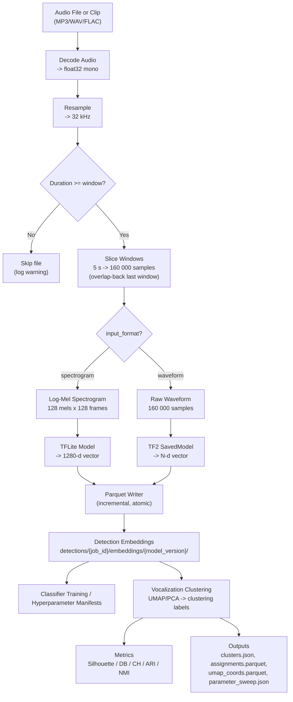

# Signal Processing Parameters

> Read this when working on audio decoding, feature extraction, windowing, detection embeddings, or clustering parameters.

## Parameters

| Parameter | Default | Description |
|-----------|---------|-------------|
| `target_sample_rate` | 32 000 Hz | Resample target for all audio |
| `window_size_seconds` | 5.0 s | Window duration (= 160 000 samples at 32 kHz) |
| `n_mels` | 128 | Mel frequency bins |
| `n_fft` | 2048 | FFT window size |
| `hop_length` | 1252 | STFT hop (chosen so 160 000 samples -> 128 frames) |
| `target_frames` | 128 | Time frames per spectrogram (pad/truncate) |
| Spectrogram shape | 128 x 128 | (n_mels x target_frames) |
| `vector_dim` | 1280 | Embedding dimensions (Perch default) |
| `batch_size` | 100 | Parquet writer flush interval |
| UMAP `n_neighbors` | 15 | UMAP neighbor count |
| UMAP `min_dist` | 0.1 | UMAP minimum distance |
| `umap_cluster_n_components` | 5 | UMAP dimensions for HDBSCAN input (visualization always 2D) |
| `cluster_selection_method` | leaf | HDBSCAN selection: 'leaf' (fine-grained) or 'eom' (coarser) |
| HDBSCAN `min_cluster_size` | 5 | Minimum points per cluster |
| `clustering_algorithm` | hdbscan | `"hdbscan"`, `"kmeans"`, or `"agglomerative"` |
| `n_clusters` | 15 | For kmeans/agglomerative |
| `linkage` | ward | For agglomerative: `"ward"`, `"complete"`, `"average"`, `"single"` |
| `reduction_method` | umap | `"umap"`, `"pca"`, or `"none"` |
| `distance_metric` | euclidean | `"euclidean"` or `"cosine"` (passed to UMAP + HDBSCAN) |
| `normalization` | per_window_max | Spectrogram normalization: `"per_window_max"`, `"global_ref"`, `"standardize"` (in feature_config) |
| Parameter sweep range | 2-50 | Sweeps HDBSCAN (min_cluster_size x selection_method) + K-Means (k=2..30) |
| `tf_force_cpu` | `false` | Force CPU for TF2 SavedModel inference, skipping GPU (env: `HUMPBACK_TF_FORCE_CPU`) |
| `run_classifier` | `false` | Opt-in: run logistic regression classifier baseline on category labels |
| `stability_runs` | 0 | Opt-in: number of stability re-runs (>= 2 to enable); re-clusters with different random seeds |
| `enable_metric_learning` | `false` | Opt-in: train MLP projection head via triplet loss, re-cluster, compare metrics |
| `ml_output_dim` | 128 | Metric learning: projection output dimensionality |
| `ml_hidden_dim` | 512 | Metric learning: hidden layer dimensionality |
| `ml_n_epochs` | 50 | Metric learning: training epochs |
| `ml_lr` | 0.001 | Metric learning: Adam learning rate |
| `ml_margin` | 1.0 | Metric learning: triplet loss margin |
| `ml_batch_size` | 256 | Metric learning: triplets per epoch |
| `ml_mining_strategy` | semi-hard | Metric learning: `"random"`, `"hard"`, or `"semi-hard"` triplet mining |

## Windowing Rules

Audio is sliced into fixed-length windows using an **overlap-back** strategy instead of zero-padding:

| Scenario | Behavior |
|----------|----------|
| Audio >= 1 window, last chunk is full | Normal: no overlap, no padding |
| Audio >= 1 window, last chunk is partial | **Overlap-back**: shift last window start backward so it ends at the audio boundary, overlapping with the previous window. Contains only real audio. |
| Audio < 1 window (shorter than `window_size_seconds`) | **Skipped entirely**: produces 0 windows, 0 embeddings. A warning is logged. |

**Why not zero-pad?** Zero-padded final windows create out-of-distribution spectrograms that cause false positives in classifiers. The overlap-back strategy ensures every window contains only real audio.

**Minimum audio duration** = `window_size_seconds` (default 5.0 s). Audio files shorter than this threshold are skipped by:
- `slice_windows()` / `slice_windows_with_metadata()` — yield nothing
- `count_windows()` — returns 0
- Detection worker — logs warning, increments `n_skipped_short` in summary
- Detection-embedding generation and downstream training/clustering flows depend on those retained detection rows rather than on standalone embedding-set jobs

`WindowMetadata` carries `is_overlapped: bool` to flag overlap-back windows (replacing the former `is_padded` field).

## Timeline Spectrogram Rendering

Shared timeline PNG tiles are rendered from PCEN-normalized STFT magnitude.
The default display renderer is `PerFrequencyWhitenedOceanRenderer`
(`renderer_id = "per-frequency-whitened-ocean"`, version `3`). It keeps the
same PCEN parameters and Lifted Ocean palette, then preserves Lifted Ocean as a
pixel floor while adding per-frequency percentile whitening detail to make
coarse-zoom background structure more visible.

`LiftedOceanRenderer` (`renderer_id = "lifted-ocean"`, version `1`) remains as
the unchanged baseline renderer with a lifted dark-blue floor, gamma
compression, and a lower display ceiling.
`OceanDepthRenderer` (`renderer_id = "ocean-depth"`, version `7`) remains in the
codebase as an unused compatibility renderer for side-by-side experiments or
rollback. Renderer id and version are part of the tile cache identity, along
with zoom, frequency range, and output pixel geometry.

Timeline rendering uses direct NumPy/Pillow color mapping and PNG encoding for
marker-free tiles. Low frequencies are flipped to the bottom of the encoded
image to match the previous `imshow(origin="lower")` orientation, and bicubic
resizing is preserved for tile-size normalization.

## Embedding Pipeline Diagram

