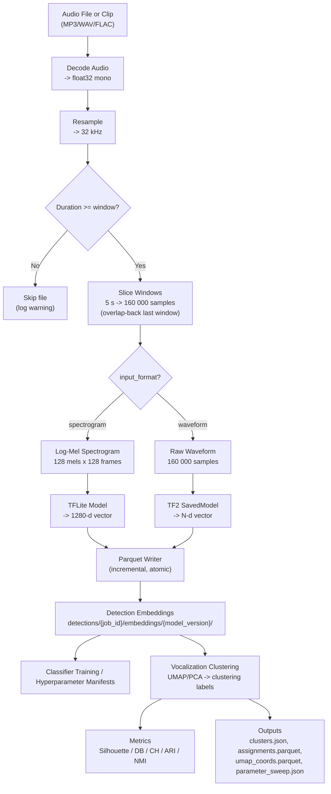

# Signal Processing Parameters

> Read this when working on audio decoding, feature extraction, windowing, detection embeddings, or clustering parameters.

## Parameters

| Parameter | Default | Description |
|-----------|---------|-------------|
| `target_sample_rate` | 32 000 Hz | Resample target for all audio |
| `window_size_seconds` | 5.0 s | Window duration (= 160 000 samples at 32 kHz) |
| `n_mels` | 128 | Mel frequency bins |
| `n_fft` | 2048 | FFT window size |
| `hop_length` | 1252 | STFT hop (chosen so 160 000 samples -> 128 frames) |
| `target_frames` | 128 | Time frames per spectrogram (pad/truncate) |
| Spectrogram shape | 128 x 128 | (n_mels x target_frames) |
| `vector_dim` | 1280 | Embedding dimensions (Perch default) |
| `batch_size` | 100 | Parquet writer flush interval |
| UMAP `n_neighbors` | 15 | UMAP neighbor count |
| UMAP `min_dist` | 0.1 | UMAP minimum distance |
| `umap_cluster_n_components` | 5 | UMAP dimensions for HDBSCAN input (visualization always 2D) |
| `cluster_selection_method` | leaf | HDBSCAN selection: 'leaf' (fine-grained) or 'eom' (coarser) |
| HDBSCAN `min_cluster_size` | 5 | Minimum points per cluster |
| `clustering_algorithm` | hdbscan | `"hdbscan"`, `"kmeans"`, or `"agglomerative"` |
| `n_clusters` | 15 | For kmeans/agglomerative |
| `linkage` | ward | For agglomerative: `"ward"`, `"complete"`, `"average"`, `"single"` |
| `reduction_method` | umap | `"umap"`, `"pca"`, or `"none"` |
| `distance_metric` | euclidean | `"euclidean"` or `"cosine"` (passed to UMAP + HDBSCAN) |
| `normalization` | per_window_max | Spectrogram normalization: `"per_window_max"`, `"global_ref"`, `"standardize"` (in feature_config) |
| Parameter sweep range | 2-50 | Sweeps HDBSCAN (min_cluster_size x selection_method) + K-Means (k=2..30) |
| `tf_force_cpu` | `false` | Force CPU for TF2 SavedModel inference, skipping GPU (env: `HUMPBACK_TF_FORCE_CPU`) |
| `run_classifier` | `false` | Opt-in: run logistic regression classifier baseline on category labels |
| `stability_runs` | 0 | Opt-in: number of stability re-runs (>= 2 to enable); re-clusters with different random seeds |
| `enable_metric_learning` | `false` | Opt-in: train MLP projection head via triplet loss, re-cluster, compare metrics |
| `ml_output_dim` | 128 | Metric learning: projection output dimensionality |
| `ml_hidden_dim` | 512 | Metric learning: hidden layer dimensionality |
| `ml_n_epochs` | 50 | Metric learning: training epochs |
| `ml_lr` | 0.001 | Metric learning: Adam learning rate |
| `ml_margin` | 1.0 | Metric learning: triplet loss margin |
| `ml_batch_size` | 256 | Metric learning: triplets per epoch |
| `ml_mining_strategy` | semi-hard | Metric learning: `"random"`, `"hard"`, or `"semi-hard"` triplet mining |

## Windowing Rules

Audio is sliced into fixed-length windows using an **overlap-back** strategy instead of zero-padding:

| Scenario | Behavior |
|----------|----------|
| Audio >= 1 window, last chunk is full | Normal: no overlap, no padding |
| Audio >= 1 window, last chunk is partial | **Overlap-back**: shift last window start backward so it ends at the audio boundary, overlapping with the previous window. Contains only real audio. |
| Audio < 1 window (shorter than `window_size_seconds`) | **Skipped entirely**: produces 0 windows, 0 embeddings. A warning is logged. |

**Why not zero-pad?** Zero-padded final windows create out-of-distribution spectrograms that cause false positives in classifiers. The overlap-back strategy ensures every window contains only real audio.

**Minimum audio duration** = `window_size_seconds` (default 5.0 s). Audio files shorter than this threshold are skipped by:
- `slice_windows()` / `slice_windows_with_metadata()` — yield nothing
- `count_windows()` — returns 0
- Detection worker — logs warning, increments `n_skipped_short` in summary
- Detection-embedding generation and downstream training/clustering flows depend on those retained detection rows rather than on standalone embedding-set jobs

`WindowMetadata` carries `is_overlapped: bool` to flag overlap-back windows (replacing the former `is_padded` field).

## Timeline Spectrogram Rendering

Shared timeline PNG tiles are rendered from PCEN-normalized STFT magnitude.
The default display renderer is `PerFrequencyWhitenedOceanRenderer`
(`renderer_id = "per-frequency-whitened-ocean"`, version `3`). It keeps the
same PCEN parameters and Lifted Ocean palette, then preserves Lifted Ocean as a
pixel floor while adding per-frequency percentile whitening detail to make
coarse-zoom background structure more visible.

`LiftedOceanRenderer` (`renderer_id = "lifted-ocean"`, version `1`) remains as
the unchanged baseline renderer with a lifted dark-blue floor, gamma
compression, and a lower display ceiling.
`OceanDepthRenderer` (`renderer_id = "ocean-depth"`, version `7`) remains in the
codebase as an unused compatibility renderer for side-by-side experiments or
rollback. Renderer id and version are part of the tile cache identity, along
with zoom, frequency range, and output pixel geometry.

Timeline rendering uses direct NumPy/Pillow color mapping and PNG encoding for
marker-free tiles. Low frequencies are flipped to the bottom of the encoded
image to match the previous `imshow(origin="lower")` orientation, and bicubic
resizing is preserved for tile-size normalization.

## Embedding Pipeline Diagram



## Piano Roll Notes — Harmonic-Viterbi v5

`note_extractor_v5` (ADR-071, `extractor_version = "v5"`) was the default
Piano Roll Notes extractor before v6 (ADR-072), and remains v6's decode stage. It
replaces v4's ridge-locked HPS divisor selection with direct harmonic-sum F0
estimation over the CQT plus log-frequency Viterbi smoothing. Temporal
smoothness is part of the cost function rather than a post-filter, so frame-to-
frame F0 hopping is penalised during decoding instead of being amplified by
independent per-frame divisor selection.

**Pipeline:**

```
event audio (with pad)
  -> CQT (humpback.processing.piano_roll_cqt.compute_event_cqt)
  -> per-frame background subtraction (pad-zone percentile, voicing-only)
  -> per-frame harmonic-sum emission H_t(f0) over candidate F0 grid
  -> per-frame voicing oracle (CQT peak minus noise floor > tau_voicing)
  -> log-frequency Viterbi over candidates + rest state
  -> contour segmentation (run splitting at unvoiced gaps)
  -> harmonic-sibling note synthesis
  -> NotesV3Result (notes + per-frame contour rows)
```

**Inputs:**

- `audio: np.ndarray` (mono float32) and `sample_rate: int` for one segmented event,
  pre-padded by `params.pad_seconds` on each side. The pad zones double as the
  background-subtraction reference frames.
- `params: ExtractNotesV5Params` with sub-dataclasses: `cqt`, `stft`, `harmonic_viterbi`,
  `segmentation`, `harmonic`, `midi`.
- `ridge_sidecar_rows`: accepted for signature parity with v3/v4 but unused; v5 derives F0 directly from the CQT.

**Outputs:** `NotesV3Result` — list of `NoteV3` (one per F0 note + harmonic siblings) and
list of per-frame `ContourFrame` rows. The worker writes `event_notes_v5.parquet`
and `event_note_contours_v5.parquet`. Contour rows write `subharmonic_octave = 0`
(field is reserved and unused in v5).

**Worker default `pad_seconds`:** 0.25 s for v5 (vs. 0.05 s for v3/v4). The
wider pad is required for the pad-zone background subtraction to gather enough
"noise-only" frames (default `background_min_pad_frames = 8`). When the pad is
too short, background subtraction silently no-ops and chronic low-frequency
ridges (ship hum, hydrophone self-noise) re-enter the voicing oracle.

**Key `HarmonicViterbiParams` defaults (see source for full set):**

| Parameter | Default | Notes |
|-----------|---------|-------|
| `n_harmonics` | 4 | Candidates summed across harmonic stack |
| `harmonic_weight` | `"inv_sqrt_k"` | Weighting by harmonic index k |
| `f0_min_hz` / `f0_max_hz` | 30 / 600 Hz | Candidate F0 search range |
| `cents_tolerance` | 50 ¢ | Bin tolerance around k·f0 |
| `tau_voicing` | 3.0 | CQT peak minus noise-floor threshold for voicing |
| `transition_lambda` | 6.0 | Squared log-frequency Viterbi step cost |
| `voicing_transition_cost` | 1.0 | Voiced ↔ rest hysteresis |
| `min_harmonics_present` | 2 | Per-candidate harmonic gate |
| `max_h1_below_strongest` | 2.5 | H1 prominence gate (sub-fundamental rejection) |
| `background_source` | `"pad"` | Background frames from pad zones |
| `background_percentile` | 25.0 | Per-bin percentile across background frames |
| `background_min_pad_frames` | 8 | Skip subtraction if too few pad frames per side |

**Why v5 replaces v4:** v4's ridge-locked HPS divisor selection independently
picked a divisor per frame, so frame-to-frame divisor flapping fragmented
otherwise-coherent F0 traces (the failure mode documented on token #47 of job
`690580c5…`). v5 bakes log-frequency smoothness into the cost function, so the
smoothed F0 trace is the global minimum-cost path through the harmonic-sum
emission, not an artifact of post-filtering.

v3 (`extractor_version = "v3"`) and v4 (`extractor_version = "v4"`) remain
reachable for backfill / comparison; their on-disk parquet sidecars are
byte-identical to pre-v5 outputs at their respective defaults.

## Piano Roll Notes — Slope De-spike v6

`note_extractor_v6` is the predecessor to the current default Piano Roll Notes
extractor (ADR-072, `extractor_version = "v6"`). It is v5's decode plus a slope-based F0 contour
de-spike pass applied to each decoded F0 segment *before* note building. v5's
Viterbi contour is usually smooth, but a strong-enough wrong-octave /
wrong-harmonic emission over a short run of frames can still leave a surviving
spike — a brief F0 excursion that jumps off the local trajectory and returns
(e.g. the ~15-semitone plunge at t≈1.2 s on event
`669849340bff411390e5eaaf1ec9b9e9` of job `690580c5…`).

**Pipeline:**

```
v5 decode (CQT -> emission -> voicing -> Viterbi -> contour segmentation)
  -> despike_f0_segments (slew-rate anchor walk per segment)
  -> harmonic-sibling note synthesis (n·f0 over the cleaned contour)
  -> NotesV3Result
```

**De-spike (slew-rate anchor walk):** per segment, with per-frame budget
`max_step_log = max_slope_oct_per_s · dt` (where `dt = cqt.hop_length /
cqt.target_sample_rate`), walk frames left→right holding a trusted anchor.
A frame is accepted as a new anchor when `|log2 f[i] − log2 f[anchor]| ≤
(i − anchor) · max_step_log`; otherwise scanning continues. When a later frame
re-enters the envelope, the intervening out-of-envelope frames were an
out-and-back spike: their log-frequency is replaced by linear interpolation
between the anchor and that frame. Spike frames are *retained* (timing,
`frame_index`, `strength`, and `subharmonic_octave = 0` unchanged) — only their
log-frequency is rewritten, so the note stays one continuous contour. **Only
out-and-back excursions are bridged (return-to-baseline):** if an excursion
never returns within `max_spike_frames`, it is a genuine level change (a
register jump, or a signal drop that resumes at a different pitch), so the walk
re-anchors past it WITHOUT bridging and the real contour is left intact. (This
guard was added after event `cb23dfcd…` showed a pure "steep-is-always-an-error"
rule over-bridging a real 60→530 Hz register jump into a garbage ramp — ADR-072
amendment.) **Trailing trim:** the one exception is a short non-returning
excursion at the very *end* of a segment (≤ `max_trailing_trim_frames`) — as a
call's energy fades the tracker drops to a sub-fundamental, so that spurious
low-frequency tail is trimmed and the note ends at the call (ADR-072 Amendment 2,
events `2054e6de…` / `c82fa1fc…`). A non-returning *lead-in* and a *sustained*
end-of-call level change are kept.

**Harmonic correction is free:** harmonic presence is searched at `n · (cleaned
f0)` and harmonic bends reuse the cleaned F0 cents (cents conservation), so the
harmonic ribbons inherit the de-spiked contour with no separate pass.

**`DespikeParams` defaults:**

| Parameter | Default | Notes |
|-----------|---------|-------|
| `enabled` | `True` | `False` makes v6 byte-identical to v5 |
| `max_slope_oct_per_s` | 6.0 | Slope threshold (~72 semitones/s); ~4× above any real glide |
| `max_spike_frames` | 12 | Excursion-width guard (~140 ms) |
| `max_trailing_trim_frames` | 4 | Max length of a trimmed non-returning trailing excursion (~46 ms) |

**Outputs:** `NotesV3Result`; the worker writes `event_notes_v6.parquet` and
`event_note_contours_v6.parquet` (schemas identical to v3–v5). v6 inherits v5's
worker defaults (30 Hz STFT floor, `segmentation.min_break_frames = 6`,
`pad_seconds = 0.25`). v3–v5 sidecars remain reachable by explicit
`extractor_version` pinning; there is no auto-backfill of v6.

## Piano Roll Notes — Residual Discontinuity v7

`note_extractor_v7` is the current default Piano Roll Notes extractor (ADR-074,
`extractor_version = "v7"`). It keeps v6's harmonic-Viterbi decode and
return-to-baseline de-spike, then adds two post-decode passes before the shared
F0/harmonic note builders run.

**Pipeline:**

```
v5 decode (CQT -> emission -> voicing -> Viterbi -> contour segmentation)
  -> v6 despike_f0_segments (out-and-back bridge + trailing trim)
  -> ridge-guided flat-segment rescue
  -> residual discontinuity splitting
  -> harmonic-sibling note synthesis (n·final f0)
  -> NotesV3Result
```

**Residual discontinuity split:** adjacent retained F0 frames whose actual slope
exceeds `max_continuous_slope_oct_per_s` become note boundaries. This is the
complement to v6's non-returning-excursion guard: v6 preserves a branch jump
rather than incorrectly bridging it, and v7 prevents that preserved jump from
being rendered as one continuous MPE pitch bend. Fragments shorter than
`segmentation.min_note_frames` are dropped.

**Ridge-guided flat-segment rescue:** v7 can use the persisted Event Encoder
STFT ridge sidecar when the decoded F0 segment is nearly flat but the aligned
ridge carries a smooth pitch sweep. The ridge must overlap enough frames, move
enough in log-frequency, and be smooth after a linear trend fit. The rescued F0
is the ridge divided by a median carrier harmonic, preserving the original
decoded segment timing, frame indexes, strength, and `subharmonic_octave = 0`.

**v7 parameter defaults:**

| Parameter | Default | Notes |
|-----------|---------|-------|
| `discontinuity.enabled` | `True` | `False` disables residual branch-jump splitting |
| `discontinuity.max_continuous_slope_oct_per_s` | 6.0 | Same slope budget as v6 de-spike |
| `ridge_rescue.enabled` | `True` | `False` disables ridge-guided flat-segment rescue |
| `ridge_rescue.max_decoded_span_semitones` | 2.0 | Segment must be nearly flat |
| `ridge_rescue.min_ridge_span_semitones` | 5.0 | Ridge must show a meaningful bend |
| `ridge_rescue.min_overlap_frames` | 8 | Minimum aligned ridge/F0 coverage |
| `ridge_rescue.max_ratio_mad_semitones` | 2.0 | Smoothness threshold after ridge trend fit |
| `ridge_rescue.min_carrier_harmonic` | 1 | Lowest accepted ridge carrier harmonic |
| `ridge_rescue.max_carrier_harmonic` | 32 | Highest accepted ridge carrier harmonic |

**Outputs:** `NotesV3Result`; the worker writes `event_notes_v7.parquet` and
`event_note_contours_v7.parquet` (schemas identical to v3–v6). v7 inherits v5/v6
worker defaults (30 Hz STFT floor, `segmentation.min_break_frames = 6`,
`pad_seconds = 0.25`). v3–v6 sidecars remain reachable by explicit
`extractor_version` pinning; there is no auto-backfill of v7.
